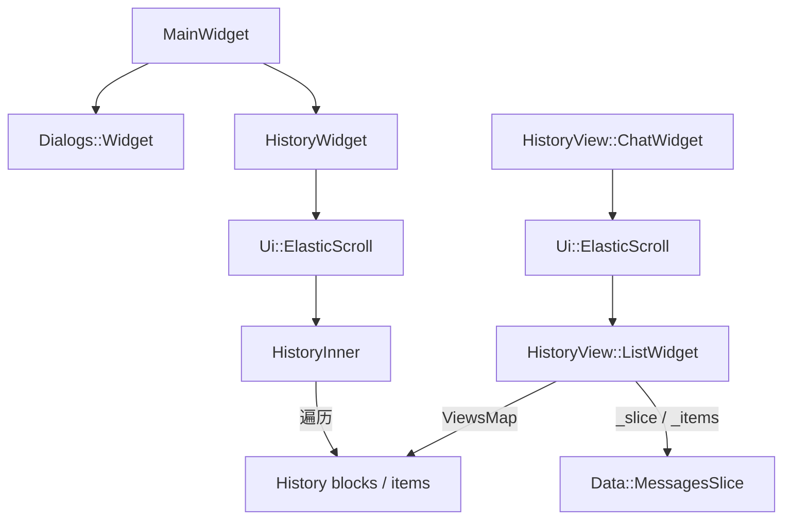
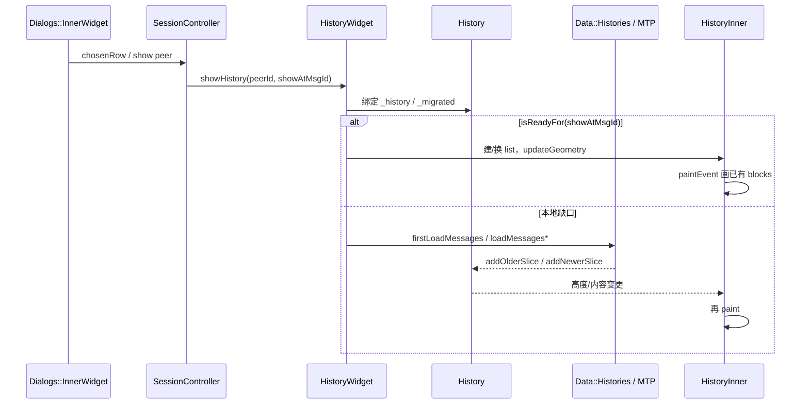

# 07 · 消息列表结构与 widget 树（打开会话 → 第一帧）

> 基于 `dev` 分支 Contents / raw 头文件：`history/history_widget.h`、`history/history_inner_widget.h`、`history/view/history_view_list_widget.h`、`history/view/history_view_chat_section.h`、`history/history.h`、`mainwidget.h`（见 04 章）。**未**全量克隆。推测处已标注。

打开左侧会话行后，右侧中栏并不是一个 `QListView`，而是 **自绘消息流**：`HistoryWidget`（主会话中栏）或 `HistoryView::ChatWidget`（分栏/专题等 `Section`）托管 `Ui::ElasticScroll`，再挂 `HistoryInner` 或 `HistoryView::ListWidget`。第一帧的目标是：**尽快画出「锚点附近」已有的 `HistoryItem` 视图**，缺数据再异步补页（见 08）。

## 代码落点（Where）

| 路径 | 角色 |
|---|---|
| `Telegram/SourceFiles/history/history_widget.*` | 主中栏：打开 peer、首包/预加载、compose、滚动宿主 |
| `…/history/history_inner_widget.*` | 经典消息列表：`HistoryInner` 直接遍历 `History::blocks` 绘制 |
| `…/history/view/history_view_list_widget.*` | 新列表：`ListWidget` + `ListDelegate` + `MessagesSlice` |
| `…/history/view/history_view_chat_section.*` | `ChatWidget` / `ChatMemento`：Section 形态复用 `ListWidget` |
| `…/history/history.*` | `History : Data::Thread`；`blocks` / `scrollTopItem` |
| `…/history/view/history_view_element.*` | `Element` / `ElementDelegate`：单条消息的视图对象 |
| `…/history/view/history_view_message.*` / `…_service_message.*` | 普通消息 / 服务消息 Element 实现 |
| `mainwidget.h`（见 04） | `MainWidget` 并列持有 Dialogs 与 `HistoryWidget` |

命名空间：UI 列表在 `HistoryView`；会话数据在 `History` / `Data`；窗口编排在 `Window`。

## 两条宿主路径（并存）

主窗口「点开会话」默认走 **HistoryWidget + HistoryInner**；Forum / 定时消息 / 部分新 chat section 走 **ChatWidget + ListWidget**。二者共享 `Element` 绘制模型，但 **行缓存与滚动锚点的持有位置不同**。



### `HistoryWidget`（`history_widget.h`）

- 继承 `Window::AbstractSectionWidget`，并实现 `HistoryView::CornerButtonsDelegate`。
- 打开入口：`showHistory(PeerId, MsgId showAtMsgId, SectionShow)`；另有 `setMsgId` / `delayedShowAt` / `fastShowAtEnd`。
- 滚动宿主：`object_ptr<Ui::ElasticScroll> _scroll` + `QPointer<HistoryInner> _list`。
- 加载闸门（头文件可见成员）：`_firstLoadRequest` / `_preloadRequest` / `_preloadDownRequest`（注释：**非真实** `mtpRequestId`，由 `Data::Histories::sendRequest` 分配的内部 id）；公开 `loadMessages` / `loadMessagesDown` / `firstLoadMessages`；边界查询 `historyLoadedAtTop/Bottom()` 用于禁用「仍可翻页」一侧的 overscroll bounce。
- 周边 chrome：`TopBarWidget`、compose（`ComposeControls` 等）、`CornerButtons`、`PinnedBar` / `GroupCallBar` / `TranslateBar`、语音条等——**第一帧消息区之外**的条带，但几何会改变 `_scroll` 的可用高度。

### `HistoryInner`（`history_inner_widget.h`）

- 继承 `Ui::RpWidget`；构造注入 `HistoryWidget*`、`ElasticScroll*`、`SessionController*`、`History*`。
- 通过 `HistoryMainElementDelegateMixin` 把 `ElementDelegate` 接到 Inner（`History` 侧有 `_delegateMixin`）。
- 几何 API：`itemTop(item|view)`、`viewByItem`、`scrollToElementLocalY`、`findViewForPinnedTracking`。
- 绘制入口：`paintEvent`；无障碍有独立 `history_inner_widget_accessibility.*`。
- **数据绑定**：直接读 `History::blocks`（`deque<unique_ptr<HistoryBlock>>`），每个 block 内 `vector<unique_ptr<Element>> messages`。

### `HistoryView::ListWidget`（`history_view_list_widget.h`）

- 同样是 `Ui::RpWidget` + `ElementDelegate`，但通过 `ListDelegate` 抽象数据源（`ChatWidget` 实现 `WindowListDelegate`）。
- 状态：`Data::MessagesSlice _slice`、`vector<not_null<Element*>> _items`、`ViewsMap _views`（`flat_map<HistoryItem*, unique_ptr<Element>>`）。
- 记忆体：`ListMemento::{aroundPosition, idsLimit, ScrollTopState{item, shift}}`；`ChatMemento` 内嵌 `ListMemento _list`。
- `ChatWidget` 成员：`QPointer<ListWidget> _inner` + `unique_ptr<ElasticScroll> _scroll`。

## 打开会话 → 第一帧（时序）



可核对的语义要点：

1. **`History::isReadyFor(MsgId)` / `getReadyFor(MsgId)`**：本地 `blocks` 是否已覆盖目标锚点；不够则拉片（08）。
2. **锚点默认**：`History::showAtMsgId` 常为 `ShowAtUnreadMsgId`；底部则 `scrollTopItem == nullptr`（头注释：在底部时 offset 无定义）。
3. **双 History**：`HistoryWidget` 可同时持有 `_history` 与 `_migrated`（群升级超级群前的旧会话），Inner 需跨两条时间线拼视口（**推测**：绘制枚举时拼接 migrated + current）。
4. **合成滚动状态（经典路径）**：`History` 公开字段 `scrollTopItem` + `scrollTopOffset`；注释写明 `scrollTop = top(scrollTopItem) + scrollTopOffset`。ListWidget 路径改用 `listScrollTopItemId` / `listScrollTopItemDate` / `listScrollTopShift`（同一头文件注释：新 ListWidget 不再填满 blocks 式 `scrollTopItem`）。

## Element 树（第一帧实际画什么）

```
HistoryItem（数据，Session 拥有）
  └─ HistoryView::Element（视图；经典路径挂在 HistoryBlock::messages）
        ├─ text / reactions / reply / service bits
        └─ unique_ptr<Media>   // photo/document/… 见 10
```

- `HistoryItem::createView(ElementDelegate*)` → `unique_ptr<Element>`；`mainView()` / `setMainView` 登记「主视图」。
- `Element::draw(Painter&, PaintContext)` 为纯虚；`Message` / `ServiceMessage` 等实现。
- Delegate 决定：是否隐藏 reply、未读样式、author rank、chat mode（`ElementChatMode`）等——`HistoryInner` / `ListWidget` 都实现了大套 `element*` 接口。

## 与 Dialogs 列表的对照（第一帧心智模型）

| | Dialogs（04/05） | History（本章） |
|---|---|---|
| 行对象 | `Dialogs::Row` → `Entry` | `Element` → `HistoryItem` |
| 滚动宿主 | `ElasticScroll` + `InnerWidget` | 同上 + `HistoryInner` / `ListWidget` |
| 虚拟化 | `findByY` + clip 内 paint | block/item Y 枚举 + clip（09） |
| 数据面 | 多 `MainList` | 单 peer 的 `History`（+ migrated）/ SparseIds slice |

## 小结

打开会话的第一帧，是 **Widget 树就位 + 锚点附近已有 Element 自绘**；缺页由 `HistoryWidget` 的 load 闸门触发，不阻塞 chrome。经典路径把视图挂在 `History::blocks`，新路径用 `ListWidget` 的 `_slice/_items/_views` + `ListMemento` 持久化滚动。两者共用 `Element`/`Media` 绘制栈。

## 下一章

数据模型、SparseIds 切片、gap 与 MTP 翻页 → [`08-history-data-pagination.md`](08-history-data-pagination.md)。
