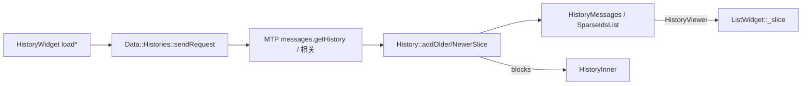
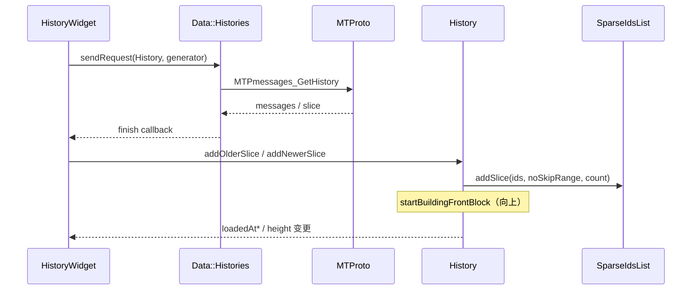

# 08 · 消息列表数据模型与加载 / 分页

> 承接 [`07-history-structure-entry.md`](07-history-structure-entry.md)。材料：同上头文件 + sparse 核对 `history_widget.cpp` / `history.cpp` / `data_messages.h`。**未**全量克隆整仓。

消息列表的「数据」分两层：**实体**（`History` / `HistoryItem`）与 **可查询切片**（`Storage::SparseIdsList` → `Data::HistoryMessages` → `MessagesSlice`）。UI 翻页 = 在缺口处向服务器要一段连续 id 区间，再 `addOlderSlice` / `addNewerSlice` 灌进 blocks，或让 `ListWidget` 订阅 `HistoryViewer` 产出的 slice。

## 代码落点

| 路径 | 角色 |
|---|---|
| `history/history.*` | `History`：items / blocks / loadedAt* / add*Slice |
| `history/history_item.*` | 单条消息实体；`createView` / `mainView` / `media()` |
| `data/data_histories.*` | Session 级 `Histories`：findOrCreate、读收件箱、发信/删信、请求队列 |
| `data/data_history_messages.*` | `HistoryMessages` + `HistoryViewer` / `HistoryMergedViewer` |
| `storage/storage_sparse_ids_list.*` | `SparseIdsList`：多 slice、gap、query around |
| `data/data_sparse_ids.*` / `data_messages.*` | slice 查询结果类型（`MessagesSlice` 等） |
| `history_widget.*` | `firstLoadMessages` / `loadMessages` / `loadMessagesDown` |

## 实体层：`History` 与 `HistoryItem`

### 所有权（头文件可见）

```
Data::Histories::_map : unordered_map<PeerId, unique_ptr<History>>
History
  ├─ unordered_set<unique_ptr<HistoryItem>> _items     // 实体唯一所有者
  ├─ deque<unique_ptr<HistoryBlock>> blocks            // 视图块（经典路径）
  ├─ unique_ptr<Data::HistoryMessages> _messages       // SparseIds 索引
  ├─ _loadedAtTop / _loadedAtBottom
  └─ inbox/outbox read till、unreadCount、drafts…
```

- 工厂：`makeMessage` / `addNewMessage` / `addNewLocalMessage` / `createItem(s)`。
- 销毁：`destroyMessage`、`clear(ClearType)`（含 `Unload` 等枚举）。
- 切片入口：`addOlderSlice(QVector<MTPMessage>)`、`addNewerSlice(...)`；内部 `addCreatedOlderSlice`、`startBuildingFrontBlock` / `finishBuildingFrontBlock`（**向上翻页时在前端建新 block**）。

### `HistoryBlock`

- `vector<unique_ptr<Element>> messages`；`resizeGetHeight(width, ResizeRequest)`；双向 `previousBlock` / `nextBlock` 经 `_indexInHistory`。
- `ResizeRequest::{ReinitAll, ResizeAll, ResizePending}` —— 与「仅重算挂起项」有关（09）。

### 就绪与边界

| API | 语义（注释/命名） |
|---|---|
| `loadedAtBottom()` | 最后一条已在列表中 |
| `loadedAtTop()` | 再往上没有更多（已到历史尽头） |
| `isReadyFor(MsgId)` | 本地是否已有足够消息展示该锚点 |
| `getReadyFor(MsgId)` | 不足则触发准备（加载） |
| `minMsgId()` / `maxMsgId()` | 当前已知范围 |
| `loadAroundId()` | 围绕哪条去拉 |

`HistoryWidget::historyLoadedAtTop/Bottom()` **镜像** `loadMessages*` 的 early-return 条件，供 ElasticScroll 决定是否还允许该方向 overscroll。

## SparseIds：gap 模型

`Storage::SparseIdsList` 不是单一连续数组，而是 **多个 `Slice{flat_set<MsgId> messages, MsgRange range}`**：

- `addSlice(ids, noSkipRange, count?)`：声明「此 range 内无空洞」，并把 id 并入；可与相邻 slice `uniteAndAdd` 合并。
- `addExisting` / `addNew`：单点插入并维护 no-skip。
- `removeOne` / `removeAll` / `invalidateBottom`：删除与底部失效。
- 查询：`SparseIdsListQuery{aroundId, limitBefore, limitAfter}` → `SparseIdsListResult{count?, skippedBefore?, skippedAfter?, messageIds}`。
- 更新流：`sliceUpdated()` → `SparseIdsSliceUpdate`。

`Data::HistoryMessages` 薄封装 `_chat: SparseIdsList`，并暴露 `HistoryViewer` / `HistoryMergedViewer` / `HistoryMessagesViewer`（`rpl::producer`，围绕 `MsgId`/`MessagePosition` 要前后 limit）。**ListWidget** 侧用 `_slice: Data::MessagesSlice` + `refreshRows(old)` 消费这些 producer（头文件可见 `refreshViewer`）。



### 已核对：`firstLoadMessages`（`history_widget.cpp`）

| 常量 | 值 |
|---|---|
| `kMessagesPerPageFirst` | **30**（贴底首包等） |
| `kMessagesPerPage` | **50** |
| `kPreloadHeightsCount` | **3**（距边缘约 3 屏触发预载，见 09） |

- 按 `_showAtMsgId`（Unread / End / 具体 id / migrated 负 id）选 `from`、`offsetId`、`offset`（around 时常 `-loadCount/2`）。
- `Data::Histories::sendRequest(..., RequestType::History, …)` 内发 **`MTPmessages_GetHistory`**；done → `messagesReceived` → `addOlderSlice` / `addNewerSlice`。
- 空 older slice → `_loadedAtTop = true`；空 newer → `_loadedAtBottom = true`。
- 向上灌入走 `startBuildingFrontBlock` / `finishBuildingFrontBlock`（避免只往 last block 追加）。

## 加载闸门（HistoryWidget）

头文件成员（注释强调 id **不是**原生 `mtpRequestId`）：

| 字段 | 用途 |
|---|---|
| `_firstLoadRequest` + `_firstLoadFromTheStart` | 打开会话首包 |
| `_preloadRequest` | 向上预加载 |
| `_preloadDownRequest` | 向下预加载 |
| `_delayedShowAtMsgId` + `_delayedShowAtRequest` | 延迟跳转到指定消息 |
| `_supportPreloadHistory` / `_supportPreloadRequest` | Support 模式预载另一会话 |

`Data::Histories::sendRequest(history, RequestType, generator)`：

- `RequestType::{History, ReadInbox, Delete, Send}`。
- 每 peer 一份 `State`：`postponed` / `sent` map、读收件箱 till、是否 postpone entry 请求。
- `postponeHistoryRequest`：避免与进行中的同类型请求打架（例如读 inbox 与拉历史互斥策略）。



## ListWidget 路径的分页语义

- `_aroundPosition` + `_idsLimit`（默认 `kMinimalIdsLimit = 24`）：视口中心与请求窗口大小。
- `loadedAtTop/Bottom` / `loadedAtTopKnown`：slice 边界是否已知且触顶。
- `appendToEnd` / `insertAfter`：本地新消息插入；`InjectAfterLookup` 处理「插在锚点后但仍可能滑出末端」。
- `skippedAtTop/Bottom()`：SparseIds 的 skipped* 映射到 UI 空白/占位（**推测**：用于显示「上方还有 N 条」或触发加载，而非画假行）。

迁移会话：`HistoryMergedViewer` 把 migrated + current 合成 **universal** MsgId 时间线，供合并绘制。

## 与 Dialogs 缓存的差异（预告 11）

| | Dialogs `MainList` | History 消息 |
|---|---|---|
| 主键 | `Dialogs::Key`（peer/thread） | `MsgId` / `FullMsgId` |
| 完整性 | 列表可「云端 count + 本地子集」 | SparseIds **显式 gap** |
| 更新 | dialog 顶栏/排序键 | item 增删改 + sliceUpdated |
| 卸载 | 行仍在 MainList | `History::clear(Unload)` / `Histories::unloadAll` |

## 小结

分页不是「一个 vector 下标 ++」，而是 **SparseIds 多 slice + no-skip range** 声明连续性；`HistoryWidget` 用内部 request id 串行化首包/上下预载；经典 UI 吃 `blocks`，新 UI 吃 `MessagesSlice` viewer。实体永远在 `History::_items`，视图可重建。

## 下一章

行高、视口绘制与滚动锚点 → [`09-history-layout-virtualization.md`](09-history-layout-virtualization.md)。
