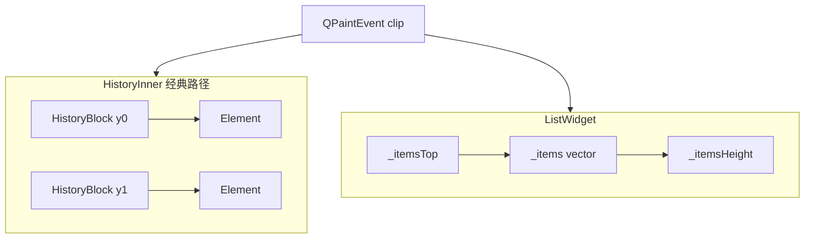
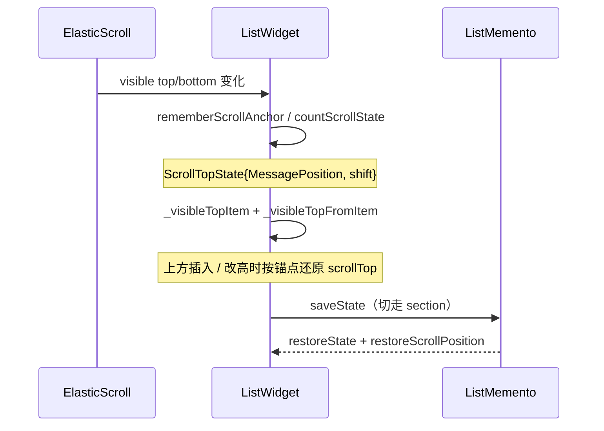

# 09 · 消息列表布局虚拟化与滚动锚点

> 承接 [`08-history-data-pagination.md`](08-history-data-pagination.md)。材料：`history.h`（`HistoryBlock` / `scrollTop*`）、`history_inner_widget.h`、`history_view_list_widget.h`、`history_view_element.h`、`history_view_object.h`（经 Element 继承）。对照 Dialogs 的 `findByY` 见 [`05-dialogs-impl-memory-perf.md`](05-dialogs-impl-memory-perf.md)。

消息行高度高度可变（文本折行、媒体、回复条、日期分隔、未读条）。tdesktop **不**用 `QListView` delegate，而是自管 Y 坐标：只对 clip 相交的 `Element` 调用 `draw`，并用「锚点消息 + 像素偏移」在插入/改高时保持视口稳定。

## 代码落点

| 路径 | 角色 |
|---|---|
| `History::blocks` / `HistoryBlock` | 经典路径：块 Y、块高、`resizeGetHeight` |
| `History::{scrollTopItem,scrollTopOffset}` | 经典滚动锚点 |
| `History::{listScrollTopItemId,…}` | ListWidget 持久化锚点 |
| `HistoryInner` | `paintEvent`、`itemTop`、enumerate* 模板 |
| `ListWidget` | `_items` / `_itemsHeight` / `_visibleTop*` / `countScrollState` |
| `Element` / `Object` | `countOptimalSize` / `resizeGetHeight` / `draw` |

## 高度模型

### 经典：`HistoryBlock::resizeGetHeight`

```
History._height / _width
  └─ blocks[i].setY(…) ; blocks[i].height()
        └─ messages[j] : Element
              resizeGetHeight(width) → 行高
```

- `ResizeRequest::ReinitAll`：宽度或布局规则大变，全量重算。
- `ResizeAll`：全部 resize。
- `ResizePending`：只处理标了 pending 的项（`History::Flag::HasPendingResizedItems` / `PendingAllItemsResize`）。
- `History::mainViewHeightAdjusted(view, delta)`：单行变高时调整后续几何与滚动。

### ListWidget：扁平 `_items`

- `_items: vector<not_null<Element*>>` + `_itemsTop` / `_itemsWidth` / `_itemsHeight`。
- `_itemAverageHeight`：估算「未知 skipped」区域高度（与 SparseIds `skippedBefore/After` 配合，**推测**用于 scrollbar 比例）。
- `_itemsRevealHeight` + `ItemRevealAnimation`：新行揭示动画占用的额外高度（11）。
- `resizeGetHeight(newWidth)` override；`resizeItem` / `viewHeightAdjusted` 局部更新。



## 视口绘制（虚拟化）

两边都是 **部分绘制**，不是只创建可见 widget：

1. 取得 `clip`（`paintEvent`）与可见区间（ListWidget：`_visibleTop` / `_visibleBottom`）。
2. 用 Y 二分 / 线性枚举定位首个相交 `Element`（ListWidget：`findItemIndexByY` / `findItemByY` / `strictFindItemByY`）。
3. `enumerateItems` 模板（ListWidget / Inner 均有同类模式）按 `TopToBottom` 或 `BottomToTop` 回调；回调返回 false 即停。
4. 对每个可见 view：`preparePaintContext` → `Element::draw`；另有 `enumerateUserpics` / `enumerateDates` / `enumerateForumThreadBars` 画浮动头像与粘性日期。

与 Dialogs `RowsScrollCache` 不同：消息列表 **未见** 同款「整行 QImage 滚动缓存」头文件字段（**推测**：消息行太大/太容易变，收益差；媒体另走 unload，见 10）。Dialogs 那套不能直接类推到 History。

## 滚动锚点（抗跳动核心）

### 经典路径（`history.h` 注释原文语义）

- 保存：`scrollTopItem`（视口顶部那条 Element）+ `scrollTopOffset`（窗口顶到该消息顶的偏移）。
- 公式：`scrollTop = top(scrollTopItem) + scrollTopOffset`。
- 销毁时：`getNextScrollTopItem` —— item 没了就指下一条，**offset 不变**。
- 在底部：`scrollTopItem == nullptr`，offset 无定义（粘底）。
- `findScrollTopItem(top)` / `countScrollState` 辅助。

### ListWidget 路径



关键 API：

| API | 作用 |
|---|---|
| `countScrollState()` / `ScrollTopState` | `{MessagePosition item, int shift}` |
| `rememberScrollAnchor()` / `saveScrollState` / `restoreScrollState` | 变更前记、变更后恢 |
| `scrollTopForPosition` / `scrollTopForView` | 跳转目标 Y |
| `showAtPosition` / `animatedScrolling` | 带动画滚到消息 |
| `scrollTo(scrollTop, AnimatedScroll)` | 瞬时 vs 动画 |
| `_scrollToAnimation` | `Ui::Animations::Simple` |
| `saveState` / `restoreState` + `ListMemento` | Section 往返 |

`History` 上的 `listScrollTopItemId` / `listScrollTopItemDate` / `listScrollTopShift` 用于 **新列表把锚点存回 History**，避免仅靠已空的 `scrollTopItem`。

### 粘底与「跳到底 vs 跳到未读」

- `insideJumpToEndInsteadOfUnread()` / `jumpToBottomInsteadOfUnread()`：用户意图分流。
- `atNewestEdge()`：是否贴最新。
- Corner buttons（`HistoryView::CornerButtons`）委托给 `HistoryWidget` / Chat 宿主，驱动未读/提到/向下箭头（07 已列宿主）。

## 几何与 ElasticScroll

- `HistoryWidget::setGeometryWithTopMoved(rect, topDelta)`：顶边移动时把 delta **加进 scroll**，避免内容视觉跳动（头注释明确）。
- `_synteticScrollEvent` / `_lastUserScrolled`：区分程序滚动与用户滚动（决定是否取消粘底、是否显示 scroll date 等，**推测**结合 `_scrollDate*` 定时器）。
- ListWidget：`_scrollDateShown` + `_scrollDateOpacity` + `_scrollDateHideTimer` —— 滚动时浮显日期条。

## 与 Dialogs 虚拟化对照

| | Dialogs Inner | History Inner / List |
|---|---|---|
| 命中 | `List::findByY` | block/item Y 或 `findItemByY` |
| 行高 | `Row::height` 相对稳定 | Element 可变且常 pending resize |
| 滚动缓存 | `RowsScrollCache` 256/32MiB | 未见对等字段 |
| 锚点 | 有时 `scrollToY` 补偿 move | `scrollTopItem` / `ScrollTopState` 一等公民 |
| 平均高 | 较少需要 | `_itemAverageHeight` 估 skipped |

## 小结

虚拟化 = **clip 内枚举 Element + 可变行高 resize 协议**；平滑滚动 = **消息锚点 + 像素 shift**，并在 Unload/插入/动画揭示时恢复。ListWidget 把锚点结构化进 `ListMemento`，经典路径把锚点挂在 `History` 公开字段上。

## 下一章

行内媒体、`keepAlive`、heavy part 卸载 → [`10-history-media-memory.md`](10-history-media-memory.md)。
