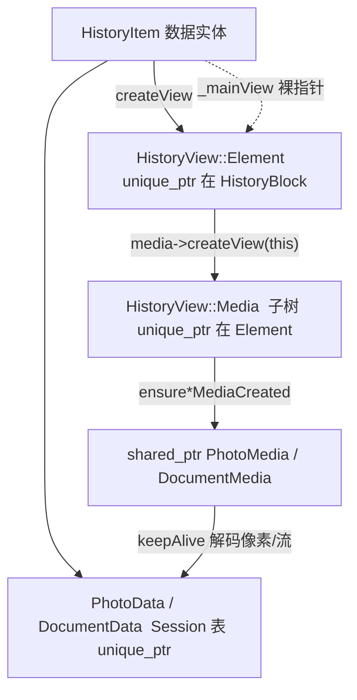

# 10 · 行内媒体生命周期：Media、keepAlive、unload

> **范围**：消息行内 `HistoryView::Media` 如何挂上 Element、重资源（图/GIF/文档预览）如何登记与卸载，与 Dialogs 行缓存策略对照。  
> 材料：`history_view_element.*`、`history/view/media/history_view_media.h`、`history_view_gif.h`、`history_view_photo*` / `document*`、`data/data_session.*`（`registerHeavyViewPart` / `unloadHeavyViewParts`）、`history_inner_widget.cpp`（`visibleAreaUpdated`）、`history_widget.cpp`（`setHistory` unload）。推测 **〔推测〕**。

## 1. 对象分层（所有权）



| 对象 | 拥有者 | 备注 |
|---|---|---|
| `HistoryItem` | `Data::Session` 消息表 | 跨 UI 存活 |
| `Element` | `HistoryBlock::messages` | 主列表；ListWidget 可另持 view |
| `HistoryView::Media` | `Element`（如 `_media`） | `Photo`/`Gif`/`Document`/`Poll`/… |
| `Data::PhotoMedia` / `DocumentMedia` | **`shared_ptr`** | 多视图可共享解码/加载态；弱引用回收 |
| Heavy 登记 | `Session::_heavyViewParts` | `flat_set` 观察 `ViewElement*` |

`Media` 基类提供虚函数：

```text
virtual bool hasHeavyPart() const;
virtual void unloadHeavyPart();
```

具体子类（GIF/网页预览/主题文档等）持有 `mutable shared_ptr<Data::*Media> _dataMedia`，在 `unloadHeavyPart` 里释放像素/流，保留布局尺寸所需的轻量信息。

## 2. Heavy 登记与卸载

### 2.1 登记

绘制或创建重附件时，Element/Media 路径调用：

- `session().data().registerHeavyViewPart(view)`
- 对称 `unregisterHeavyViewPart`

`Session::unloadHeavyViewParts(delegate)`：卸该 delegate 下全部 heavy。  
`unloadHeavyViewParts(delegate, from, till)`：仅当 view 的垂直区间 **落在窗口外**（与 `elementIntersectsRange` 协作）才 `unloadHeavyPart()`。

### 2.2 滚动时滑动窗口

`HistoryInner::visibleAreaUpdated`：

```text
pages = kUnloadHeavyPartsPages  // 2
from  = visibleTop - pages * visibleHeight
till  = visibleBottom + pages * visibleHeight
session().data().unloadHeavyViewParts(_elementDelegate, from, till)
// migrated delegate 同样来一遍
```

```mermaid
stateDiagram-v2
  [*] --> LayoutOnly: Element 已创建
  LayoutOnly --> HeavyLoaded: draw / 可见 / ensureMedia
  HeavyLoaded --> HeavyLoaded: registerHeavyViewPart
  HeavyLoaded --> LayoutOnly: unloadHeavyPart（离屏 >2 屏）
  LayoutOnly --> [*]: Element 销毁 / ClearType::Unload
  HeavyLoaded --> [*]: 换会话 setHistory<br/>unloadHeavyViewParts(delegate)
```

换会话：`HistoryWidget::setHistory` 对旧 history 先 `unloadHeavyViewParts(delegate)` 再 `forceFullResize()`，避免旧聊天 GIF 解码缓冲拖到新会话。

### 2.3 Userpic 旁路缓存

与 heavy 并列：`_userpics.size() > kClearUserpicsAfter(50)` 时把 map move 到 `_userpicsCache`，paint 末 `clear` — 限制头像 `QImage` 峰值，逻辑类似 Dialogs 停滚清缓存，但阈值更粗。

## 3. 媒体类型与成本直觉（非 benchmark）

| 子类（文件前缀 `history_view_`） | 典型 heavy | 卸载关注点 |
|---|---|---|
| `photo` / `gif` | `PhotoMedia`/`DocumentMedia`、streaming | 帧缓冲、stream reader |
| `document` / `theme_document` | 文档缩略图 | `_dataMedia` |
| `media_grouped` | 多子 media | 子项分别 hasHeavy |
| `web_page` | 预览图 + 文档 | `ensurePhotoMediaCreated` |
| `poll` / `game` / … | 视实现 | 部分只卸动画层 |

**〔推测〕** `hasHeavyPart()` 为 false 的 media 不会进 `_heavyViewParts`，靠 Element 析构即可；true 的必须能在离屏时把像素降下来，否则长会话滚动内存只增不减。

## 4. Item ↔ View 生命周期陷阱

- **`_mainView`**：Item 不拥有 Element；block `remove` / `refreshView` 时必须更新或清空，否则悬空。
- **ListWidget `enforceViewForItem`**：slice 刷新时尽量复用 `_viewsCapacity` 里旧 view，减少 Media 重建；`refreshRows` 开头 `saveScrollState`。
- **`History::clear(ClearType::Unload)`**：卸视图、保留 Item — 再打开可少 MTP，但 Media heavy 应已随 view unload。

发送中动画：`Window::SessionController::sendingAnimation()` 与 `HistoryInner` paint 协作跳过/合成；与 media keepAlive 独立（H5）。

## 5. 对比 Dialogs（05）与横切（06）

| 机制 | Dialogs | History 行内媒体 |
|---|---|---|
| 滚动加速 | `RowsScrollCache` 整行位图 | 无；靠局部 draw + 少 measure |
| 保活 | Entry/Row；视频头像 overlay | `shared_ptr`*Media + heavy set |
| 离屏策略 | 停滚 120ms 清行缓存 | 视口 ±2 屏 `unloadHeavyPart` |
| 换上下文 | 切 filter 换 `_shownList` | `setHistory` 全量 unloadHeavy |

同一哲学：**主线程只保留「近处」贵资源**；远处只留布局数字。

## 6. 小结

- Media 挂在 Element 下；像素经 `shared_ptr`*Media keepAlive。
- `Session::_heavyViewParts` + 视口窗口卸载是 History 内存阀门。
- 换会话强制按 delegate 卸重；userpic 另有 50 上限。

下一篇：[11 · 更新、动画与卡顿边界](11-history-updates-jank.md)。
