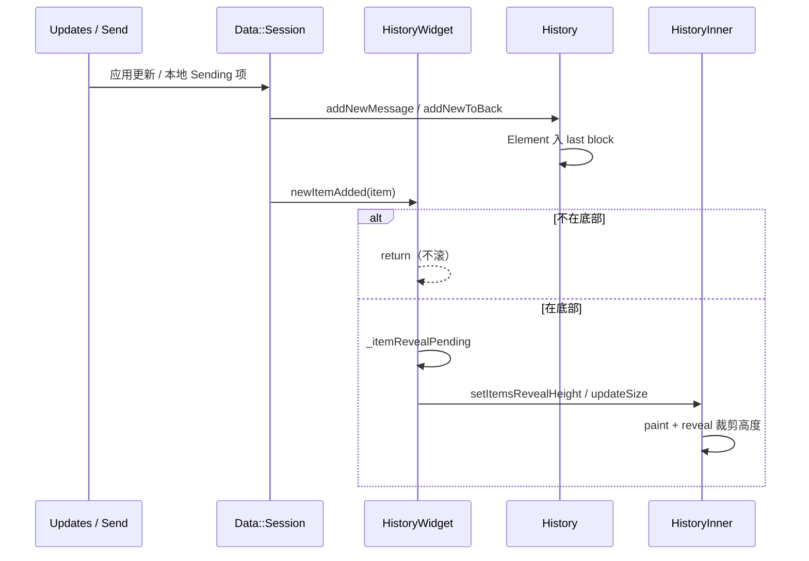
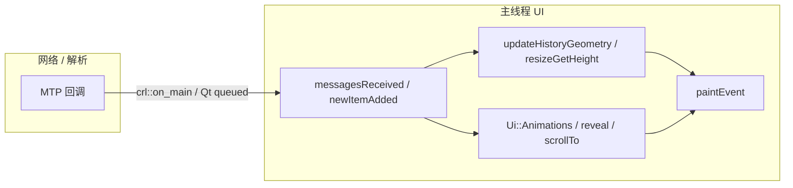

# 11 · 消息更新、动画与卡顿：插入路径 vs Dialogs 缓存

> **范围**：新消息插入、reveal/发送动画、主线程边界（`crl::on_main` / `InvokeQueued`）、与 Dialogs `RowsScrollCache` 的抗 jank 手段对比。  
> 材料：`history_widget.cpp`（`newItemAdded` / `_itemReveal*` / `animatedScrollToY`）、`history_inner_widget.cpp`（paint 短路、`sendingAnimation`）、`lib_crl` 用法、章节 05/06。推测 **〔推测〕**。

## 1. 新消息进入主列表

订阅（构造期）：`session().data().newItemAdded` → `HistoryWidget::newItemAdded`；Inner 侧也有 `itemRemoved` / `itemDataChanged`。

`newItemAdded` 要点：

1. 非本 `_history` / 未 `_historyInited` / scheduled → return。
2. `sendHistoryChangeNotifications()` — 让依赖方在「几何已相对一致」前同步。
3. 发送中：`synteticScrollToY(scrollTopMax)` 贴底。
4. 若不在底部 → **不**自动滚、不清 unread bar（用户在翻历史）。
5. 在底部且需标记已读 → `readInboxOnNewMessage`、可能 `startEffectOnRead`。
6. `anim::Disabled()` 时跳过 reveal；否则 `_itemRevealPending.emplace(item)`。

Reveal：通过 `_revealHeight` 从内容高度里「藏住」新消息高度，再动画减小，避免整表突然跳变（`setItemsRevealHeight` / `changeItemsRevealHeight`）。

## 2. 发送动画与 paint 协作

- `controller()->sendingAnimation().appendSending(...)`：从 compose 区飞入气泡。
- `HistoryInner::paintEvent` 查询 `sendingAnimation().hasAnimatedMessage(item)`，避免双绘或错误层级。
- 切会话：`showHistory` 开头 `sendingAnimation().clear()`。

**〔推测〕** 动画采样仍在主线程 tick（`Ui::Animations`），与 Dialogs 置顶位移同一套 `anim::`；`anim::Disabled()` / PowerSaving 是统一减速阀（见 06）。

## 3. 主线程边界

常见跳回 UI 线程的写法：

| API | 出现场景（History） |
|---|---|
| `crl::on_main(this, [=]{ … })` | unreadMark 关闭、support preload、部分 peer 更新后几何 |
| `InvokeQueued(this, [=]{ … })` | 焦点、拖拽后续、延后 `updateHistoryGeometry` |
| `base::Timer` / `SingleQueuedInvokation` | `_updateHistoryItems`、`_scrollDateCheck` |
| MTP `.done` 链 | 最终仍应在主线程碰 widget（项目约定） |

卡顿敏感点（代码结构推断，**非**实测帧耗时）：

1. **单帧 paint**：clip 内每条 `draw` + 读状态副作用（views/reactions poll）。
2. **整宽 resize**：`forceFullResize` / pending 积压后一次打满。
3. **slice 全量 `refreshRows`**（ListWidget）：虽复用 view，仍可能 O(n) 重建 `_items`。
4. **heavy 未卸**：离屏 GIF 仍解码（H4 阀门失效时）。

缓解已见：`contentOverlapped` early-out、`hasPendingResizedItems` 拒绘、`kSkipRepaintWhileScrollMs`（widget 常量）、日期条 `SingleQueuedInvokation` 合并。

## 4. 对比 Dialogs 抗 jank 工具箱

| 手段 | Dialogs（05） | History（本篇） |
|---|---|---|
| 滚动帧减负 | `RowsScrollCache` 整行 bitmap | 无行 bitmap；靠 clip draw |
| 重叠跳过 | `contentOverlapped` | 同左 |
| 重排动画 | `pinnedShiftAnimationCallback` 局部 `update(y,h)` | reveal 高度 + `animatedScrollToY` |
| 数据窗 | 多 `MainList`，行数≈会话数 | 分页 30/50 + ±±2 屏 heavy |
| Freeze | 搜索/重排时可 freeze 通知 | pending resize 时冻结锚点与 paint |
| 测试面 | 相对更多 list 几何 | 仍偏薄；依赖 ownership/lifetime（06） |

**结论**：Dialogs 用 **缓存像素** 换滚动帧价；History 用 **数据窗口 + 锚点 + reveal** 换正确性与内存。两者都把「别在主线程做整表工作」当第一原则，但杠杆不同。

## 5. 与 ListWidget / Chat section

`ListWidget::refreshRows`：

- `saveScrollState` → 清空 `_items` → 按 slice `enforceViewForItem` → reveal 尾部新增。
- Thanos 删除动画可 `shiftAnchor` 钉住未删消息。

主 `HistoryWidget` 插入走 `History` block API，不经 `MessagesSlice`；但 jank 症状类似：**锚点失效 → 跳；pending resize → 空白帧；动画与真实高度不同步 → 抖动**。

## 6. 系列收束（07–11）

1. **07** 挂上 `HistoryInner` / 首帧  
2. **08** MTP 切片与 gap  
3. **09** 视口绘制与 scroll 锚点  
4. **10** Media heavy / keepAlive  
5. **11** 插入动画与主线程边界  

导读「下一步」可转到 stub **16 storage eviction** 或 **18 媒体管线（FFmpeg/Lottie）**。

## 7. 小结

- 底部新消息：`newItemAdded` → reveal pending → 高度动画，而不是裸 `scrollTopMax` 突变（发送中除外）。
- UI 变更经 `crl::on_main` / queued；paint 带读回执副作用需节制。
- 相对 Dialogs：History 几乎不靠行位图缓存，而靠分页与 unload。
