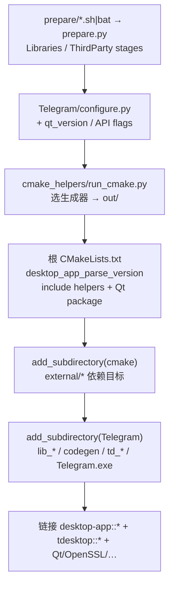

# 12 · 构建系统深潜：CMake helpers、`configure.py` 与依赖获取

> 基于 `dev` 分支根 `CMakeLists.txt`、`Telegram/configure.py`、`Telegram/cmake/telegram_options.cmake`、`Telegram/build/{version,set_version.py,prepare/prepare.py}`，以及子模块 `desktop-app/cmake_helpers`（`run_cmake.py`、`version.cmake`、`variables.cmake`、`options.cmake`、`init_target.cmake`、`external/`）。未在本机完整编过；**不**声称穷尽每个 `stage()` 的平台分支。

## 1. 总览：谁在驱动构建

| 层 | 路径 | 角色 |
|---|---|---|
| 配置入口 | `Telegram/configure.py`（及 `.sh` / `.bat` 包装） | 解析架构 / 官方 target / API 凭据，调用 helpers 的 `run_cmake.run` |
| CMake 根 | 仓库根 `CMakeLists.txt` | `project(Telegram)`、解析版本、`add_subdirectory(cmake)` + `Telegram` |
| Helpers | `cmake/` → `desktop-app/cmake_helpers` | 公共选项、外部依赖、生成辅助、`init_target` / `nice_target_sources` |
| 应用 CMake | `Telegram/CMakeLists.txt` + `Telegram/cmake/*` | 可执行目标、子库、`td_*` OBJECT 库、style/scheme 生成 |
| 依赖准备 | `Telegram/build/prepare/{linux,mac}.sh` / `win.bat` → `prepare.py` | 在 `BuildPath/Libraries`（与 `ThirdParty`）按 stage 拉源码并编译缓存 |
| 官方说明 | `docs/building-{win,mac,linux,mas}.md`、`docs/api_credentials.md` | 面向贡献者的逐步构建文档 |

官方文档链接（上游 raw / 浏览路径）：

- [building-win.md](https://github.com/telegramdesktop/tdesktop/blob/dev/docs/building-win.md)
- [building-mac.md](https://github.com/telegramdesktop/tdesktop/blob/dev/docs/building-mac.md)
- [building-linux.md](https://github.com/telegramdesktop/tdesktop/blob/dev/docs/building-linux.md)（Docker + `centos_env`）
- [building-mas.md](https://github.com/telegramdesktop/tdesktop/blob/dev/docs/building-mas.md)
- [api_credentials.md](https://github.com/telegramdesktop/tdesktop/blob/dev/docs/api_credentials.md)

## 2. `configure.py` → `run_cmake` → 生成器

`Telegram/configure.py` 体量很小（约 70 行），核心是：

1. 把 `../cmake` 与 `./build` 加入 `sys.path`，导入 `run_cmake` 与 `qt_version`。
2. 若存在 `Telegram/build/target`，读出官方特殊目标（如 `win` / `win64` / `uwp` / `macstore` 等），映射架构，并要求 sibling 仓 `DesktopPrivate/custom_api_id.h` 提供 `ApiId` / `ApiHash`，转成 `-DTDESKTOP_API_ID` / `-DTDESKTOP_API_HASH`。
3. 普通贡献者构建则由命令行传入 `-D TDESKTOP_API_ID=… -D TDESKTOP_API_HASH=…`（与平台构建文档一致）。
4. `finish(run_cmake.run(scriptName, arguments))` —— `scriptName` 为脚本所在目录名（`Telegram`）。

`cmake_helpers/run_cmake.py` 的行为（摘要）：

- 在 `out/`（或带 `buildType` 的子路径）下创建构建目录。
- Windows：默认 `-AWin32` / `-Ax64` / `-AARM64` + `-T v143`（可用 `-G` 显式覆盖）。
- macOS：默认 `-GXcode`。
- 其他（Linux）：默认 `-GNinja Multi-Config`。
- 若存在 `Telegram/build/target`，追加 `-DDESKTOP_APP_SPECIAL_TARGET=…`。
- 最终 `cmake … ..`（相对 `out/` 指向上游根）。



## 3. 根 `CMakeLists.txt` 与 helpers 切面

根文件要点（`dev`）：

- `cmake_minimum_required(VERSION 3.25...3.31)`。
- `include(cmake/version.cmake)` → `desktop_app_parse_version(Telegram/build/version)`。
- `project(Telegram … VERSION ${desktop_app_version_cmake})`；Apple 启用 `OBJC`/`OBJCXX`。
- 定位：`Telegram/ThirdParty`、`Telegram`（submodules）、`cmake`（helpers）。
- 连续 include：`variables`、`nice_target_sources`、`init_target`、`generate_target`、`nuget`、`options`、`external/qt/package` 等。
- `desktop_app_skip_libs` 当前跳过 `glibmm`、`variant`。
- `add_subdirectory(cmake)` 再 `add_subdirectory(Telegram)`。

### 3.1 版本文件

`Telegram/build/version`（拉取时示例）：

```
AppVersion         7002005
AppVersionStrMajor 7.2
AppVersionStrSmall 7.2.5
AppVersionStr      7.2.5
…
AppVersionOriginal 7.2.5
```

`desktop_app_parse_version` 读取 **`AppVersionOriginal`**，解析 major/minor/patch[/alpha|beta]，写出 `desktop_app_version_cmake` 等 PARENT_SCOPE 变量。`Telegram/build/set_version.py` 用于改写该文件（及若干资源字符串），供发版脚本调用。

> **注意**：GitHub Releases 的「已发布」tag 可能落后于 `dev` 上的 `version` / `changelog.txt`（见本分析包 README）。

### 3.2 `variables.cmake` / `options.cmake` / `telegram_options.cmake`

- **helpers `variables.cmake`**：大量 `DESKTOP_APP_*` 选项（`USE_PACKAGED`、`DISABLE_AUTOUPDATE`、`DISABLE_CRASH_REPORTS`、`ENABLE_LTO`、`ASAN`、`USE_ENCHANT`、`SPECIAL_TARGET` 衍生的 `build_macstore` / `build_winstore` 等）。
- **helpers `options.cmake`**：`desktop-app::common_options` INTERFACE（`QT_NO_KEYWORDS` 等）+ 按平台 include `options_{win,mac,linux}.cmake`。
- **`Telegram/cmake/telegram_options.cmake`**：强制要求 `TDESKTOP_API_ID` / `TDESKTOP_API_HASH`（可用 `TDESKTOP_API_TEST` 注入测试凭据）；定义 `TDESKTOP_UPDATE_CHANNEL`（stable/beta/canary-*）与 canary 计数器宏。

`init_target`：默认 `cxx_std_20`，并把每个库链到 `desktop-app::common_options`。

### 3.3 `external/` 依赖面

`cmake/external/` 下可见目标族（目录名，拉取时）：`qt`、`openssl`、`ffmpeg`、`zlib`、`openal`、`webrtc`、`xxhash`、`gsl`、`ranges`、`rlottie`、`crash_reports`、`auto_updates`、`kcoreaddons`、`ada`、`tde2e` 等 —— 由 `DESKTOP_APP_USE_PACKAGED` 决定「系统包」还是「prepare 编译出的 Libraries」。

## 4. 依赖获取：`prepare.py` 的 stage 模型

平台脚本（`linux.sh` / `mac.sh` / `win.bat`）进入 `prepare.py`。模型：

- 工作根为 **BuildPath**（`tdesktop` 的上一级）；`Libraries`（Win64 时为 `Libraries/win64`）与 `ThirdParty`。
- `stage(name, commands, location='Libraries')`：按平台过滤命令，记录依赖与版本；`runStages()` 带 **cache key**（文件哈希）跳过已完成 stage。
- 典型 stage 名（非穷尽）：`patches`、`zlib`、`mozjpeg`、`openssl3`、`opus`、`ffmpeg`、`openal-soft`、`breakpad`/`crashpad`、`qt_*`、`tg_owt`、`ada`、`tde2e`、以及 Windows 专属的 `msys64` / `NuGet` / `jom` 等。

Linux 官方路径额外用 Docker 镜像 `tdesktop:centos_env`（`Telegram/build/docker/centos_env/`）执行 `build.sh`，把 `-D TDESKTOP_API_*` 传入容器内 cmake。

## 5. `Telegram/` 内生成与目标（与 helpers 协作）

`Telegram/cmake/` 中与 codegen / 协议相关的脚本（文件名已核验）：

| 文件 | 用途（由文件名 + 第 03 章交叉） |
|---|---|
| `generate_scheme.cmake` / `td_scheme.cmake` | TL → `scheme.*` |
| `generate_lang.cmake` / `td_lang.cmake` | 语言包 |
| `generate_numbers.cmake` | 数字相关生成 |
| `td_ui.cmake` | `generate_styles` + 大量 `*.style` |
| `td_mtproto.cmake` | `tdesktop::td_mtproto` |
| `lib_ffmpeg.cmake` / `lib_tgcalls.cmake` / `lib_fido2.cmake` … | 第三方封装目标 |

`lib_ui/cmake/generate_styles.cmake`（随 `lib_ui` submodule）调用宿主工具 `codegen_style`，产出 `gen/styles/style_*.{h,cpp}`（见第 15 章）。

## 6. 小结与边界

- **配置链清晰**：prepare（可选）→ configure → cmake 生成器 → 根工程 → helpers external → Telegram 可执行文件。
- **版本单一事实源**：`Telegram/build/version` 的 `AppVersionOriginal`。
- **API 凭据是硬门槛**：无 `telegram_options.cmake` FATAL_ERROR，避免误用测试 ID 上线。
- **〔推测〕** `DESKTOP_APP_SPECIAL_TARGET` 与官方 CI / `DesktopPrivate` 深度耦合；开源贡献者路径以 `docs/building-*.md` + 自有 API ID 为准。

相关：[`02-architecture.md`](02-architecture.md)、[`13-desktop-app-libs.md`](13-desktop-app-libs.md)、[`03-mtproto-networking.md`](03-mtproto-networking.md)。
