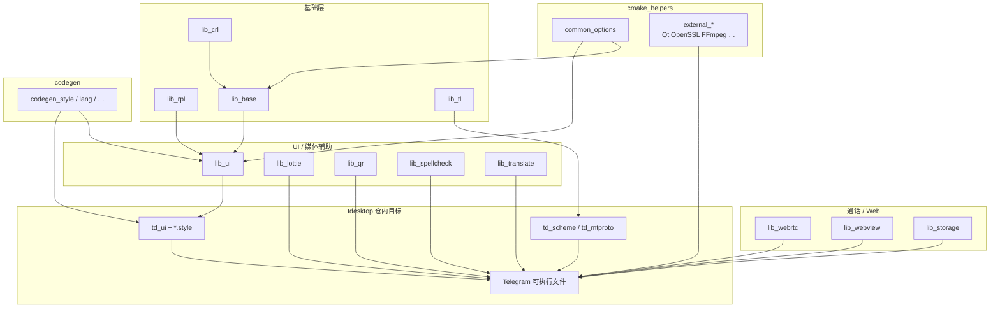

# 13 · `desktop-app` 子模块图谱：`lib_*` / codegen / cmake_helpers

> 材料：`.gitmodules`、`Telegram/CMakeLists.txt` 前部 `add_subdirectory` + `target_link_libraries`、各 `desktop-app/lib_*` 与 `codegen` / `cmake_helpers` 的 `CMakeLists.txt`（raw）。职责为一行概括 + **Telegram 如何组装**；ThirdParty 仅作对照。版本锁定 = git submodule commit（本分析未逐一打印 SHA）。

## 1. `.gitmodules` 中的 desktop-app 族

| Submodule path | 远程 | 一句话角色 |
|---|---|---|
| `cmake` | `desktop-app/cmake_helpers` | 跨应用 CMake 工具箱：选项、external、生成、`run_cmake` |
| `Telegram/codegen` | `desktop-app/codegen` | 宿主代码生成器（`codegen_style` / lang / emoji 等工具源） |
| `Telegram/lib_rpl` | `desktop-app/lib_rpl` | 头文件-only 响应式流（`rpl::producer` / `event_stream` / `variable`） |
| `Telegram/lib_crl` | `desktop-app/lib_crl` | 并发与主线程投递（`crl::on_main`、队列、时间） |
| `Telegram/lib_base` | `desktop-app/lib_base` | 基础工具与平台抽象（文件、快捷键、电池、assertion、`unique_qptr`…） |
| `Telegram/lib_ui` | `desktop-app/lib_ui` | 自绘 UI 底座：`RpWidget`、style/palette、控件与图层 |
| `Telegram/lib_tl` | `desktop-app/lib_tl` | TL 基础类型 + `generate_tl.py` |
| `Telegram/lib_storage` | `desktop-app/lib_storage` | 加密文件 / 数据库门面（与 `SourceFiles/storage` 协作） |
| `Telegram/lib_spellcheck` | `desktop-app/lib_spellcheck` | 拼写检查（系统引擎或 Hunspell） |
| `Telegram/lib_lottie` | `desktop-app/lib_lottie` | Lottie 动画帧提供与渲染 |
| `Telegram/lib_qr` | `desktop-app/lib_qr` | QR 码生成封装 |
| `Telegram/lib_translate` | `desktop-app/lib_translate` | 端侧翻译（Apple 上可走 Swift 6 路径） |
| `Telegram/lib_webrtc` | `desktop-app/lib_webrtc` | 桌面 WebRTC 环境 / ADM / 设备解析 |
| `Telegram/lib_webview` | `desktop-app/lib_webview` | 嵌入式 WebView（平台后端） |

另有大量 **`Telegram/ThirdParty/*`**（GSL、xxHash、rlottie、tgcalls、range-v3、libfido2、cld3…）——由 helpers `external/` 或 `Telegram/cmake/lib_*.cmake` 接入，**不是** `lib_*` 命名，但同属产品依赖图。

## 2. Telegram 如何组装

`Telegram/CMakeLists.txt` 顺序（核验）：

```text
add_executable(Telegram …)
add_subdirectory(lib_rpl)
add_subdirectory(lib_crl)
add_subdirectory(lib_base)
add_subdirectory(lib_ui)
add_subdirectory(lib_tl)
add_subdirectory(lib_spellcheck)
add_subdirectory(lib_storage)
add_subdirectory(lib_lottie)
add_subdirectory(lib_qr)
add_subdirectory(lib_translate)
add_subdirectory(lib_webrtc)
add_subdirectory(lib_webview)
add_subdirectory(codegen)
# 再 include cmake/td_*.cmake、lib_ffmpeg、lib_tgcalls…
```

随后 `target_link_libraries(Telegram PRIVATE …)` 同时拉两类别名：

- **`desktop-app::lib_*`**：上表 submodule 产物。
- **`tdesktop::td_*` / `tdesktop::lib_*`**：本仓 `Telegram/cmake` 内 OBJECT/静态封装（`td_ui`、`td_mtproto`、`td_scheme`、`td_lang`、`lib_tgcalls`、`lib_fido2`…）。

各库 CMake 公开别名形如 `add_library(desktop-app::lib_ui ALIAS lib_ui)`；`lib_rpl` 为 **INTERFACE**（纯头），其余多为 `STATIC` 或 `OBJECT`。

根工程先 `add_subdirectory(cmake)`，使 `desktop-app::external_*` 与 `common_options` 在子库 `init_target` 时已可用。



## 3. 分层阅读提示

| 层级 | 库 | 下游典型消费者 |
|---|---|---|
| 0 | `lib_rpl`、`lib_crl` | 几乎所有 UI / Session 代码 |
| 1 | `lib_base`、`lib_tl` | `lib_ui`、MTProto、storage |
| 2 | `lib_ui` + codegen style | `td_ui`、`SourceFiles/ui|window|dialogs|history` |
| 2b | `lib_storage` | `Storage::Account`、本地缓存 |
| 3 | `lib_lottie` / `lib_qr` / `lib_spellcheck` / `lib_translate` | 贴纸/表情、登录二维码、输入框、翻译 UI |
| 3 | `lib_webrtc` + ThirdParty `tgcalls` | `SourceFiles/calls`（见后续通话章） |
| 3 | `lib_webview` | Mini Apps / 支付 / 部分登录与代理 Web 面 |

**`codegen`**：仓库内含 `codegen/style`（`generator.cpp`、`processor.cpp`、`parsed_file.cpp` 等），构建出 `codegen_style` 可执行文件供 `generate_styles()` 的 `add_custom_command` 调用；另有 `emoji` / `lang` / `common` 工具树。

**`cmake_helpers`**：不只服务 tdesktop——注释写明 Desktop App Toolkit；tdesktop 根 `CMakeLists` 把它当「第一公民」subdirectory。

## 4. 与 ThirdParty / `td_*` 的边界

- **Submodule `lib_*`**：可独立演进、多产品复用；通过 `desktop-app::` 别名链接。
- **`Telegram/cmake/td_*.cmake`**：把 **本仓** `SourceFiles` 切片打成 OBJECT 库，减少主目标编译单元耦合（例如 `td_mtproto` vs 主目标里的 `session*`——见第 03 章）。
- **`Telegram/cmake/lib_tgcalls.cmake` 等**：包装 ThirdParty / 外部工程为 `tdesktop::` 目标。

> **〔推测〕** submodule 指针由官方在发版分支同步 bump；分析包若只看 `dev` tree，不保证与某 tag 的 SHA 一致。精确锁定请 `git submodule status`。

## 5. 小结

- desktop-app 族是 tdesktop 的「操作系统之上、产品之下」中间件。
- 组装顺序在 `Telegram/CMakeLists.txt` 一目了然：先 submodule，再 `td_*`，最后巨型 `nice_target_sources(Telegram …)`。
- UI 深度（`RpWidget` / palette / `.style`）见 [`15-ui-system.md`](15-ui-system.md)；构建入口见 [`12-build-system.md`](12-build-system.md)。
