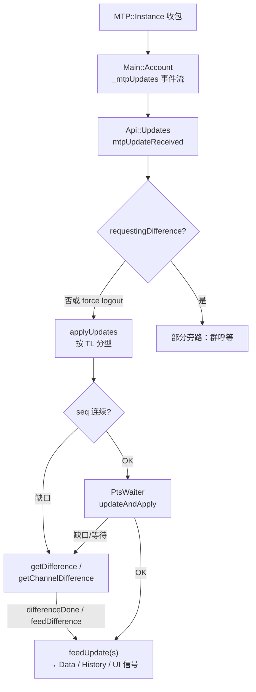

# 14 · API 层与更新机制：`SourceFiles/api`、`ApiWrap`、PTS / Updates、DC shift

> 材料：`apiwrap.h/.cpp`、`api/api_updates.h/.cpp`、`data/data_pts_waiter.h`、`mtproto/core_types.h`、`main/main_session.h`、`main/main_account.h`，以及 `SourceFiles/api/` 目录文件列表。未跟完 `feedUpdate` 的每个 `MTPUpdate` 分支。

## 1. 代码落点

| 路径 | 角色 |
|---|---|
| `Telegram/SourceFiles/apiwrap.*` | `ApiWrap`：继承 `MTP::Sender`，会话级请求门面 + 子 API 对象持有 |
| `Telegram/SourceFiles/api/api_*.{h,cpp}` | 领域 API 模块（约 57 个 `.h`，拉取时） |
| `Telegram/SourceFiles/api/api_updates.*` | `Api::Updates`：PTS/seq、difference、短更新分发 |
| `Telegram/SourceFiles/data/data_pts_waiter.*` | `PtsWaiter`：PTS 缺口排队与超时 |
| `Telegram/SourceFiles/main/main_session.*` | 持有 `std::unique_ptr<ApiWrap> _api` 与 `std::unique_ptr<Api::Updates> _updates` |
| `Telegram/SourceFiles/main/main_account.*` | `mtpUpdates()` / `mtpNewSessionCreated()` 事件流 |
| `Telegram/SourceFiles/mtproto/core_types.h` | `DcId` / `ShiftedDcId` 与 shift 常量 |

## 2. `ApiWrap`：请求门面，不是 Updates 所有者

```text
Main::Session
  ├─ _api      → ApiWrap : MTP::Sender
  └─ _updates  → Api::Updates
```

公开访问：

- `session.api()` → `ApiWrap&`
- `session.updates()` → `Api::Updates&`
- `apiWrap.updates()` **转发**为 `_session->updates()`（非二次持有）
- `apiWrap.applyUpdates(MTPUpdates)` → `this->updates().applyUpdates(...)`

`ApiWrap` 构造于 `Main::Session`，提供对话框加载、草稿上云、peer full、file reference 刷新、邀请校验等大面方法；并把诸多领域对象收进 `unique_ptr` 成员，例如（头文件可见）：

`Authorizations`、`AttachedStickers`、`BlockedPeers`、`CloudPassword`、`SelfDestruct`、`SensitiveContent`、`GlobalPrivacy`、`UserPrivacy`、`InviteLinks`、`ChatLinks`、`ViewsManager`、`PeerPhoto`、`Polls`、`TodoLists`、`ChatParticipants`、`Communities`、`UnreadThings`、`Ringtones`、`ComposeWithAi`、`Transcribes`、`Premium`、`Usernames`、`Websites`、`PeerColors`、`ReadMetrics`、`ConfirmPhone`、`ReactionsNotifySettings`、`RichTasks` …

其余能力以自由函数 / 独立翻译单元形式落在 `api/`（如 `api_sending`、`api_editing`、`api_media`、`api_chat_filters`、`api_statistics`），由 `ApiWrap` 或 UI/数据层直接调用。

`RequestKey(...)` 辅助把多参数拼成修改类请求去重键；`registerModifyRequest` / `clearModifyRequest` 管理进行中的修改请求。

## 3. `api/` 模块地图（按主题分组）

**会话与列表**：`api_updates`、`api_unread_things`、`api_chat_filters*`、`api_views`、`api_read_metrics`

**发送 / 编辑 / 媒体**：`api_sending`、`api_editing`、`api_send_progress`、`api_media`、`api_toggling_media`、`api_attached_stickers`、`api_stickers_creator`、`api_ringtones`

**Peer / 隐私 / 账号**：`api_authorizations`、`api_blocked_peers`、`api_user_privacy`、`api_global_privacy`、`api_cloud_password`、`api_self_destruct`、`api_sensitive_content`、`api_user_names`、`api_websites`、`api_peer_photo`、`api_peer_colors`、`api_peer_search`、`api_confirm_phone`

**群组 / 频道 / 社区**：`api_chat_participants`、`api_communities`、`api_invite_links`、`api_chat_links`、`api_chat_invite`、`api_report`

**互动内容**：`api_polls`、`api_todo_lists`、`api_rich_tasks`、`api_who_reacted`、`api_reactions_notify_settings`、`api_suggest_post`

**商业 / Premium / AI**：`api_premium*`、`api_credits*`、`api_earn`、`api_compose_with_ai`、`api_transcribes`、`api_statistics*`

**搜索 / 文本**：`api_messages_search*`、`api_single_message_search`、`api_text_entities`、`api_bot`、`api_hash`、`api_common`、`api_filter_updates`

> 上表按文件名归纳，**不是**运行时依赖图。

## 4. Updates / PTS 路径

### 4.1 入口

`Api::Updates` 构造时：

1. 订阅 `session->account().mtpUpdates()` → `mtpUpdateReceived`。
2. 订阅 `mtpNewSessionCreated` → 触发 `getDifference()`。
3. 发送 `MTPupdates_GetState`，`stateDone` 初始化 pts/date/qts/seq。
4. 内嵌 `PtsWaiter _ptsWaiter`（`kWaitForSkippedTimeout = 1000` ms）。

`mtpUpdateReceived`：刷新 `_lastUpdateTime`、重启「无更新」ping 定时器；若未在 `requestingDifference()`（或含强制登出通知）则 `applyUpdates`，否则仍可能应用群呼参与者类更新。

### 4.2 `applyUpdates` 分型（头/实现可见）

| TL 类型 | 行为摘要 |
|---|---|
| `updates` / `updatesCombined` | seq 连续性检查 → `processUsers/Chats` → `feedUpdateVector` → `setState` |
| `updateShort` | 单条 `feedUpdate` |
| `updateShortMessage` / `updateShortChatMessage` | 数据未齐则 `getDifference`；否则 `updateAndApply(pts, ptsCount, …)` |
| `updateShortSentMessage` | 发送回执类短更新（实现后续分支） |
| 其他 | 实现内继续 match（篇幅略） |

seq 缺口：`_bySeqUpdates` 缓存 + `_bySeqTimer`；超时走 `getDifference`。  
PTS 缺口：`PtsWaiter::updated` / `updateAndApply` 决定立即应用或进入 skip 队列；`getDifference` / `getChannelDifference` / `requestChannelRangeDifference` 补洞。

`feedUpdate` / `feedUpdateVector` 把单个 `MTPUpdate` 落到 `Data::Session`、History、通话、emoji interaction 等（**〔推测〕** 与第 08/11 章消息插入路径在 `Data` 层汇合）。



## 5. DC shift：API 视角的「逻辑 DC」

`mtproto/core_types.h`：

```text
kDcShift = 10000
ShiftedDcId = dcId + kDcShift * shift
BareDcId / GetDcIdShift 互逆
```

| 常量 | 值 | 用途（命名所示） |
|---|---:|---|
| `kConfigDcShift` | 0x01 | 配置拉取 |
| `kLogoutDcShift` | 0x02 | 登出 |
| `kUpdaterDcShift` | 0x03 | 客户端更新通道 |
| `kExportDcShift` / `kExportMediaDcShift` | 0x04 / 0x05 | 导出 |
| `kGroupCallStreamDcShift` | 0x06 | 群呼流 |
| `kStatsDcShift` | 0x07 | 统计 |
| `kBaseDownloadDcShift` | 0x10 | 下载会话族起点（`kMaxMediaDcCount=0x10`） |
| `kBaseUploadDcShift` | 0x20 | 上传会话族起点 |
| `kDestroyKeyStartDcShift` | 0x100 | 销钥 |

业务 API（`ApiWrap` / `api_*`）经 `MTP::Sender` 发往默认主 DC；媒体/配置等通过 **shifted DcId** 复用同一套会话机器但隔离连接与密钥槽（与第 03 章 `Dcenter` / `Session` 呼应）。

> **〔推测〕** 具体哪个 `api_*` 调用传入何种 shift，需在对应 `.cpp` 的 `MTP::` 发送处逐点核对；本章只固定常量语义。

## 6. 小结

- **所有权**：`Updates` 与 `ApiWrap` 并列挂在 `Main::Session`；`ApiWrap` 做请求与子模块容器，`Updates` 做实时一致性。
- **一致性主轴**：pts + seq + difference；`PtsWaiter` 吸收乱序。
- **扩展方式**：新领域倾向新增 `api_foo.*` + 在 `ApiWrap` 持有或直接从功能代码调用。

相关：[`03-mtproto-networking.md`](03-mtproto-networking.md)、[`08-history-data-pagination.md`](08-history-data-pagination.md)、[`11-history-updates-jank.md`](11-history-updates-jank.md)。
