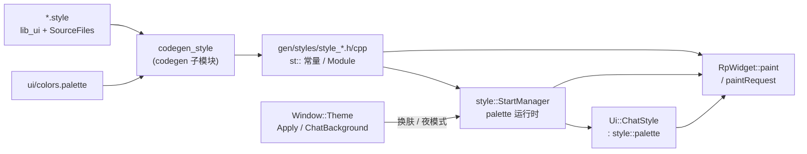

# 15 · UI 体系：`lib_ui`、`RpWidget`、主题与 style codegen

> 材料：`desktop-app/lib_ui`（`ui/rp_widget.h`、`ui/style/style_core*.h`、`ui/colors.palette`、`cmake/generate_styles.cmake`、`CMakeLists.txt`）、`desktop-app/codegen` 的 `codegen/style/`、`Telegram/cmake/td_ui.cmake`、`SourceFiles/window/themes/window_theme.h`、`SourceFiles/ui/chat/chat_style.h`。未逐步跟 `codegen_style` 解析器实现。

## 1. 分层：toolkit UI vs 产品 UI

| 层 | 位置 | 内容 |
|---|---|---|
| Toolkit | `Telegram/lib_ui` submodule | `RpWidget`、通用控件、`style::` 运行时、基础 `.style` / `colors.palette`、emoji 生成 |
| 产品 OBJECT 库 | `tdesktop::td_ui`（`Telegram/cmake/td_ui.cmake`） | 大量业务 `.style` + `SourceFiles` 下可复用 UI 片段（boxes/calls/dialogs 样式相关源） |
| 产品主题 | `SourceFiles/window/themes/*`、`Resources/*.tdesktop-theme` | 日/夜主题包、编辑器、背景 |
| 聊天气泡样式 | `SourceFiles/ui/chat/chat_style.*`、`chat_theme.*` | `ChatStyle : style::palette`、气泡/名牌颜色 |

主可执行文件另链 `desktop-app::lib_ui`，并在 macOS 等平台复制 `lib_ui.rcc` 到 Resources（`Telegram/CMakeLists.txt` 可见 `cp …/lib_ui.rcc`）。

## 2. `RpWidget`：可订阅的 `QWidget`

`ui/rp_widget.h`：

- `RpWidgetWrap`：对底层 `QWidget*` 提供 **rpl** 表面——`events()`、`geometryValue()`、`sizeValue()`、`paintRequest()`、`shownValue()`、`alive()` / `death()` 等。
- `paintOn(Fn<void(QPainter&)>)`：把绘制回调挂到 paint 流。
- `RpWidgetBase<Widget, Traits>`：把任意 `QWidget` 子类与 Wrap 组合。
- `class RpWidget : public RpWidgetBase<QWidget>`：默认叶子/容器基类。

设计意图（从 API 可读出，非官方注释全文）：

1. **几何与可见性变成流**，方便 `rpl::combine` 驱动子布局，而少手写 `resizeEvent` 蜘蛛网。
2. **绘制请求可组合**：列表/气泡常订阅 `paintRequest()` 或覆写 paint，与 `style::` 颜色/图标配合。
3. 与 `lib_rpl` / `lib_crl` 同一家族：UI 更新仍应回到主线程（见第 06/11 章）。

Dialogs / History 等产品控件多继承或组合 `Ui::RpWidget`（前文章节已见 `HistoryInner` 等路径）。

## 3. Style codegen：从 `.style` / `.palette` 到 C++

### 3.1 `lib_ui` 自身

`lib_ui/CMakeLists.txt`：

```text
generate_palette(lib_ui ui/colors.palette)
generate_styles(lib_ui …  basic.style / layers.style / widgets.style)
generate_emoji(lib_ui emoji.txt …)
```

`ui/colors.palette`：命名颜色表（如 `windowBg`、`activeButtonBg`），可引用其它 token；是主题着色的「骨架」。

### 3.2 产品 `td_ui`

`td_ui.cmake` 列出超长 `style_files`（`dialogs/dialogs.style`、`history/view/…style`、`window/window.style`、`chat/chat_style.style`…），并声明依赖：

```text
lib_ui/ui/colors.palette
lib_ui/ui/basic.style
lib_ui/ui/layers/layers.style
lib_ui/ui/widgets/widgets.style
```

`generate_styles(td_ui ${src_loc} "${style_files}" "${dependent_style_files}")`（定义在 `lib_ui/cmake/generate_styles.cmake`）：

- 对每个 `foo/bar/baz.style` 生成 `gen/styles/style_baz.cpp` / `.h`。
- `COMMAND codegen_style -I${src_loc} -I…/lib_ui -I…/Resources -o…`。
- `DEPENDS codegen_style` + 全部 style/palette 输入。

`codegen/style/`（`desktop-app/codegen`）提供解析与生成器实现（`generator.cpp`、`processor.cpp`、`parsed_file.cpp`…）。

### 3.3 运行时 `style::`

`ui/style/style_core.h` 可见：

- `style::StartManager` / `StopManager`
- `PaletteChanged()` / `PaletteVersion()` / `NotifyPaletteChanged()`
- `colorizeImage`（图标染色）
- 模块 `ModuleBase::start(scale)` 注册机制（生成代码在全局注册）

生成出的 `st::…` 常量（命名惯例，前文章节与 `.style` 引用一致）在 paint 中取色、取边距、取字体与图标。



## 4. 主题与聊天气泡

### 4.1 `Window::Theme`（`window/themes/window_theme.h`）

可见 API 面：

- `Apply` / `ApplyDefaultWithPath` / `ApplyEditedPalette` / `LoadFromFile` / `LoadFromContent`
- `IsNightMode()` / `IsNightModeValue()`
- `ChatBackground`：背景图、tile、`BackgroundUpdate`（含 `paletteChanged()` 判定）
- 主题对象内含 `style::palette palette` 与 checksum 字段

资源侧：`Telegram/Resources/day-blue.tdesktop-theme`、`night.tdesktop-theme`、`night-green.tdesktop-theme` 及 custom-base 变体；云主题数据在 `data/data_cloud_themes.*`。

### 4.2 `Ui::ChatStyle`

- `class ChatStyle final : public style::palette`
- 可 `applyCustomPalette`；暴露 `paletteChanged()` / `paletteVersion()`
- 持有按颜色索引缓存的 `ColoredPalette`（名牌色等）
- 与 `ChatTheme` / `chat_theme.cpp`、History 绘制路径协作（第 09/10 章气泡绘制消费 `st`）

**〔推测〕** 全局 `style::` palette 负责壳层（窗口、列表、设置）；`ChatStyle` 在会话视图叠加聊天专属色与气泡资源，避免整应用每次进会话都重载全部 token。

## 5. 与产品控件的衔接（已核验方向）

| 机制 | 落点 |
|---|---|
| 列表行绘制 | Dialogs layout + `st::`（第 04/05 章） |
| 历史消息 | `HistoryInner` paint + `ChatStyle`（第 09–11 章） |
| 动画 | `Ui::Animations` / `anim::Disabled`（第 06/11 章） |
| 主线程 | `crl::on_main` + rpl 订阅寿命（`rpl::lifetime`） |

## 6. 小结

- **UI 不是「纯 Qt Widgets 换皮」**：`lib_ui` + style codegen + 自绘 `RpWidget` 是默认路径。
- **Codegen 边界清晰**：`.palette` / `.style` → `codegen_style` → 编译进 `lib_ui` / `td_ui`。
- **主题**在 `Window::Theme` 改 palette/背景；**聊天**再经 `ChatStyle` 特化。

相关：[`13-desktop-app-libs.md`](13-desktop-app-libs.md)、[`12-build-system.md`](12-build-system.md)、[`04-dialogs-chat-list.md`](04-dialogs-chat-list.md)、[`09-history-layout-virtualization.md`](09-history-layout-virtualization.md)。
