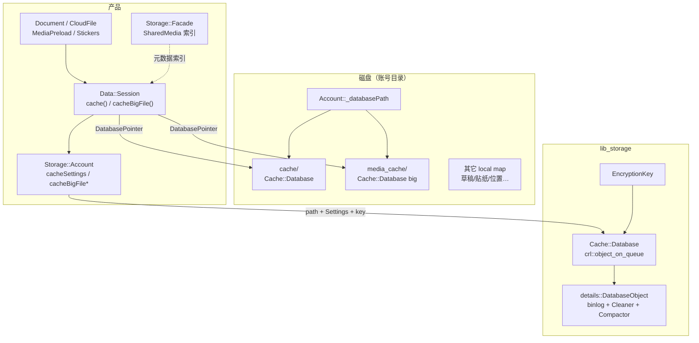

# 16 · 数据与存储：`data` / `lib_storage` / 本地缓存与 eviction

> 材料：`desktop-app/lib_storage`（`storage/cache/storage_cache_*.h`、`storage_databases.h`、`storage_encrypted_file.h`）、`Telegram/SourceFiles/storage/{storage_account,storage_domain,storage_facade,localstorage,file_download}.h`、`data/data_session.{h,cpp}`（`cache` / `cacheBigFile`）、`data_cloud_file` / `data_document` / `data_media_preload`、`data_auto_download.h`。未逐步跟 binlog 读写循环或 Cleaner 全部分支。

## 1. 分层：账号盘面 vs 加密缓存库 vs 内存模型

| 层 | 位置 | 职责 |
|---|---|---|
| Domain / passcode | `Storage::Domain` | 多账号启动、本地 `_localKey` / passcode 派生、`start(passcode)` |
| Account 盘面 | `Storage::Account` | 每账号路径、会话设置序列化、草稿/贴纸/主题、**两套 Cache 路径与限额** |
| 加密文件原语 | `lib_storage`：`EncryptedFile` / `EncryptionKey` | 通用加密 I/O |
| 缓存 DB | `Storage::Cache::Database`（`lib_storage`） | 异步 KV：put/get/remove、按 tag 清理、stats、prune |
| DB 注册表 | `Storage::Databases` + `DatabasePointer` | 按 path 复用 `unique_ptr<Cache::Database>` |
| 业务内存 | `Data::Session` | 持 `_cache` + `_bigFileCache`；媒体/文档/表情走 `cache()` / `cacheBigFile()` |
| 索引 Facade | `Storage::Facade` | SharedMedia / UserPhotos 的稀疏 ID 列表（内存索引，非大文件体） |
| 下载边界 | `storage/file_download.*`、`StreamedFileDownloader` | MTProto/Web 下载；`kMaxFileInMemory = 10 MiB` |
| 自动下载策略 | `Data::AutoDownload` | 按 Source/Type/文件大小决定是否自动拉 |



## 2. `lib_storage`：`Cache::Database` 与 eviction 边界

### 2.1 对外 API（`storage_cache_database.h`）

- 构造：`Database(path, Settings)`；实现挂在 **`crl::object_on_queue<DatabaseObject>`**（缓存 I/O 不在 UI 线程）。
- CRUD：`put` / `get` / `remove`；`putIfEmpty` / `copyIfEmpty` / `moveIfEmpty`（迁移与去重友好）。
- 带标签：`TaggedValue{ bytes, tag }`、`clearByTag`、`getWithTag`。
- 生命周期：`open(EncryptionKey)` / `close` / `clear` / `sync` / `waitForCleaner`。
- 观测：`statsOnMain()` → `Stats{ full, tagged, clearing }`。

### 2.2 `Settings` 默认值（`storage_cache_types.h`）

| 字段 | 默认 | 含义 |
|---|---:|---|
| `totalSizeLimit` | **1 GiB** | 库总字节上限 |
| `totalTimeLimit` | **31 天**（秒） | 按估计访问时间过期 |
| `maxDataSize` | `kDataSizeLimit - 1`（约 16 MiB−1） | 单条上限；账号侧再压到 `kMaxFileInMemory` |
| `trackEstimatedTime` | true | 写 `StoreWithTime` / `MultiAccess` 记录 |
| `pruneTimeout` | 5 s | prune 调度粒度 |
| `maxPruneCheckTimeout` | 1 h | prune 检查上限 |
| `staleRemoveChunk` | 256 | 一次剔除条数块 |
| `compactAfterExcess` | 8 MiB | binlog 冗余触发 Compactor |
| `writeBundleDelay` | 15 min | 写合并延迟 |
| `readBlockSize` | 8 MiB | 读块 |

`SettingsUpdate` 只暴露 `totalSizeLimit` + `totalTimeLimit`——这正是设置 UI / `Account::updateCacheSettings` 能改的两项。

### 2.3 `DatabaseObject`：Cleaner / Compactor / prune

头文件可见私有面：

- `pruneBeforeTime()` / `prune()` + `ConcurrentTimer _pruneTimer`
- `CleanerWrap`（`Cleaner`）与 `CompactorWrap`（`Compactor`，失败退避 10 s）
- 内存 `Map = unordered_map<Key, Entry>`；`Entry` 含 `useTime`、`size`、`tag`、`place`
- `_totalSize` 与 binlog 文件名常量（`BinlogFilename` / `CompactReadyFilename`）

**驱逐语义（从 Settings + API 合成，非逐步跟源）**：

1. **体积**：累计 size 超 `totalSizeLimit` → prune 按 `useTime` 淘汰最旧。
2. **时间**：`trackEstimatedTime` 时，早于 `now - totalTimeLimit` 的条目可清。
3. **显式**：`clear` / `clearByTag`；业务在会话销毁等路径调用 `cacheBigFile().clear()`（见 `data_session.cpp`）。
4. **紧凑**：excess 触发 Compactor，压缩 binlog，不改变逻辑 KV。

> **〔推测〕** Cleaner 与 prune 定时器协作清物理 place 文件；Compactor 主要回收 binlog 空洞。精确调度顺序需读 `storage_cache_cleaner.cpp` / `compactor.cpp`。

### 2.4 Key 与记录格式

- `Cache::Key{ high, low }`：128-bit；文档/缩略图等用 `DocumentData::bigFileBaseCacheKey()` 等派生。
- Binlog 记录类型：`Store` / `MultiStore` / `MultiRemove` / `MultiAccess`（可带 `EstimatedTimePoint`）。
- 单条 `EntrySize` 为 3 字节 → `kDataSizeLimit = 1<<24`。

## 3. 产品侧：双库 `cache` vs `cacheBigFile`

### 3.1 路径与密钥（`Storage::Account`）

| API | 路径后缀 | 用途（从调用点归纳） |
|---|---|---|
| `cachePath()` / `cacheSettings()` | `…/cache` | 常规小对象（缩略图、小文档字节等） |
| `cacheBigFilePath()` / `cacheBigFileSettings()` | `…/media_cache` | 「大文件」语义缓存：流媒体预取、自定义 emoji、贴纸大缩略图等 |
| `cacheKey()` / `cacheBigFileKey()` | 同 `_localKey` 派生 | `cacheBigFileKey()` 直接 `return cacheKey()` |

构造时两库限额均从 `Database::Settings()` 默认拷贝；可读设置块 `dbiCacheSettings` 持久化四元组：

`_cacheTotalSizeLimit` / `_cacheTotalTimeLimit` / `_cacheBigFileTotalSizeLimit` / `_cacheBigFileTotalTimeLimit`。

`cacheSettings()` / `cacheBigFileSettings()` 另设：

- `clearOnWrongKey = true`
- **`maxDataSize = kMaxFileInMemory`（10 MiB）** —— 比库默认单条上限更严，与「能整包进内存再 cache」一致。

### 3.2 `Data::Session` 接线（已核验）

```text
_cache      = Core::App().databases().get(local.cachePath(), cacheSettings())
_bigFileCache = Core::App().databases().get(local.cacheBigFilePath(), cacheBigFileSettings())
→ open(cacheKey / cacheBigFileKey)
Session::cache() / cacheBigFile() 返回引用
```

调用例：

- `data_media_preload.cpp`：`cacheBigFile().get/putIfEmpty(bigFileBaseCacheKey(), …)`
- `data_custom_emoji.cpp`：大 emoji 帧走 `cacheBigFile`
- `data_document.cpp`：`saveToCache()` 且 `size <= kMaxFileInMemory` 才写入常规 `cache()`
- `data_cloud_file.cpp`：通用 CloudFile ↔ `Cache::Database` 读写

### 3.3 与「文件下载」边界

| 机制 | 边界 |
|---|---|
| `kMaxFileInMemory`（`file_download.h`） | 10 MiB：可整文件进内存 / 进 Cache DB 的软上限 |
| `StreamedFileDownloader` | 大媒体边下边播，不整包塞进 Cache 单条 |
| `Storage::Facade` SharedMedia | **消息 ID 稀疏列表**，不是媒体 blob |
| `Local::` / `localstorage` | 遗留全局辅助（主题清理等）；现代账号态以 `Storage::Account` 为主 |
| `AutoDownload::Full` | Wi‑Fi/移动等 Source × Type × 大小；决定**是否发起下载**，与 Cache eviction 正交 |

## 4. 内存模型侧的「卸载」对照

磁盘 Cache eviction ≠ UI 行内 keepAlive（第 10 章）：

- **磁盘**：`Cache::Database` 按 size/time prune。
- **RAM**：`DocumentMedia` / History 行媒体 `unload`、预加载取消——由 `Data::` / HistoryView 驱动。
- **索引**：`Facade::unload(SharedMediaUnloadThread)` 丢线程级稀疏切片。

三者独立；清「缓存」设置通常打到 Database `clear` / 调限额，不直接扫 `HistoryInner`。

## 5. 小结

- **两库**：`cache` + `media_cache`（`cacheBigFile`），同密钥、分限额、分 path；经 `Databases` 注册、`Session` 打开。
- **驱逐**：`totalSizeLimit`（默认 1 GiB）+ `totalTimeLimit`（默认 31 天）+ Cleaner/Compactor；账号可 `updateCacheSettings`。
- **写入门槛**：业务侧普遍以 `kMaxFileInMemory`（10 MiB）决定能否 `put` 进 DB。
- **Facade** 管 SharedMedia/UserPhotos 索引；大文件体走下载器 + Cache DB，不混在 Facade 里。

相关：[`10-history-media-memory.md`](10-history-media-memory.md)、[`13-desktop-app-libs.md`](13-desktop-app-libs.md)、[`08-history-data-pagination.md`](08-history-data-pagination.md)。
