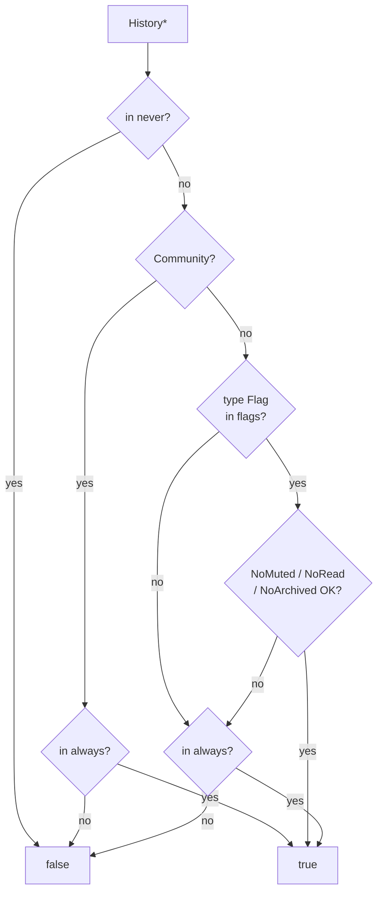
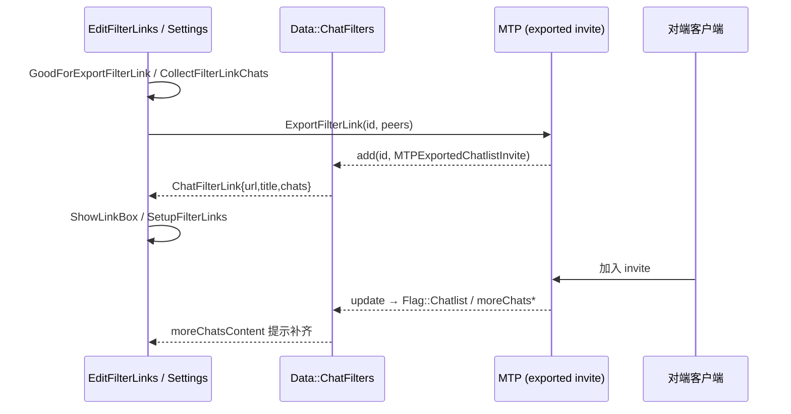

# 17 · Chat Folders / Filters 深潜：规则、chatlist 分享与设置 UI

> 材料：`data/data_chat_filters.{h,cpp}`、`boxes/filters/edit_filter_{box,chats_list,chats_preview,links}.*`、`settings/sections/settings_folders.*`、`window/window_filters_{menu,favorite}.*`、`boxes/choose_filter_box.*`。列表接线对照第 [04](04-dialogs-chat-list.md) / [05](05-dialogs-impl-memory-perf.md) 章。未逐步跟 `api/api_chat_filters` 全部分页。

## 1. 产品概念 ↔ 代码名

| 产品 | 代码 | TL |
|---|---|---|
| Chat Folders | `Data::ChatFilter` + `Data::ChatFilters` | `MTPDialogFilter` / `updateDialogFilter*` |
| Folder 标签色 | `colorIndex` / `TagColorChanged` / `tagsEnabled` | filter tags 开关 |
| 分享型文件夹 | `Flag::Chatlist` + `ChatFilterLink` | `MTPExportedChatlistInvite` |
| Business 例外 | `Flag::NewChats` / `ExistingChats` | Business 相关 filter |

归档仍是独立 `Data::Folder` / 主列表旁路；**Folders（产品名）≠ `Data::Folder`（归档容器）**。

## 2. `ChatFilter` 规则模型

### 2.1 结构

```text
ChatFilter {
  FilterId id
  ChatFilterTitle title   // TextWithEntities + isStatic
  QString iconEmoji
  optional<uint8> colorIndex
  Flags flags
  flat_set<History*> always   // 白名单（含强制纳入）
  vector<History*> pinned     // 该 filter 内置顶序
  flat_set<History*> never    // 黑名单
}
```

`FromTL` / `tl()` 与 `MTPDialogFilter` 互转；`withId` / `withTitle` / `withChatlist` 等为不可变更新辅助。

### 2.2 `Flag` 位（`RulesMask = (1<<8)-1`）

| Flag | 含义 |
|---|---|
| `Contacts` / `NonContacts` / `Groups` / `Channels` / `Bots` | 按 peer 类型纳入 |
| `NoMuted` / `NoRead` / `NoArchived` | 排除静音 / 已读 / 已归档 |
| `Chatlist` | 此 filter 为可分享 chatlist |
| `HasMyLinks` | 已有自己导出的链接 |
| `StaticTitle` | 标题静态（自定义 emoji 处理见 `ForceCustomEmojiStatic`） |
| `NewChats` / `ExistingChats` | Telegram Business 例外桶 |

### 2.3 `contains(History*)`（已核验逻辑）

1. **`never` 命中 → false**。
2. peer 映射到类型 Flag（Bot / Contact / NonContact / Groups / Channels；broadcast → Channels，超级群 → Groups）。
3. **Community 频道**：不按类型 Flag 匹配，**仅** `_always` 显式包含。
4. 若类型 Flag 置位，再检查 `NoMuted` / `NoRead` / `NoArchived`（未读态取 `chatListBadgesState()`；mention 对静音例外有特殊放行）。
5. 最后 **`always` 命中 → true**（白名单覆盖类型规则）。



## 3. `ChatFilters`：每 Folder 一份 `MainList`

`Data::ChatFilters` 挂在 `Data::Session`：

| 能力 | API / 字段 |
|---|---|
| 列表 | `_list: vector<ChatFilter>`；`list()` / `changed()` |
| 加载 | `load` / `reload` / `setPreloaded` / `apply(MTPUpdate)` |
| CRUD | `set` / `remove` / `saveOrder` / `applyUpdatedPinned` |
| **每 filter 列表** | `_chatsLists: flat_map<FilterId, unique_ptr<MainList>>`；`chatsList(filterId)` |
| 重算归属 | `refreshHistory(History*)` |
| 建议 | `requestSuggested` / `suggestedFilters` |
| Chatlist 链接 | `add` / `edit` / `destroy` / `chatlistLinks` / `reloadChatlistLinks` |
| More chats | `moreChatsContent` / `moreChats` / `moreChatsHide`（分享文件夹缺员条） |
| Tags | `tagsEnabled` / `requestToggleTags` |

与 Dialogs UI 的接点（第 04 章已述）：

- `Dialogs::InnerWidget` 在 `_filterId != 0` 时用 `chatsFilters().chatsList(filterId)->indexed()` 作为 `_shownList`。
- `Window::FiltersMenu` / `activeChatsFilter` 切换；`Flag::NoRead` 时跳过滚动位置恢复。

## 4. Chatlist 分享链路



- `Data::ChatFilterLink`：`id`、`url`、`title`、`chats`。
- `boxes/filters/edit_filter_links.*`：`ExportFilterLink`、`ShowLinkBox`、`SetupFilterLinks`、`CollectFilterLinkChats`。
- `Flag::Chatlist` / `HasMyLinks` 标记可分享与「我有链接」；`isChatlistChanged` 流通知 UI。
- `moreChats*`：对端加入后本地缺失的 peer 条，驱动「还有 N 个聊天」类 bar（`Ui::MoreChatsBarContent`）。

## 5. 设置与编辑 UI 地图

| 路径 | 角色 |
|---|---|
| `settings/sections/settings_folders.*` | 设置页「文件夹」分区入口 |
| `boxes/filters/edit_filter_box.*` | 创建/编辑单 filter（标题、图标、规则、色） |
| `edit_filter_chats_list.*` / `edit_filter_chats_preview.*` | always/never/pinned 会话挑选与预览 |
| `edit_filter_links.*` | chatlist 链接导出与管理 |
| `boxes/choose_filter_box.*` | 选择已有 filter（例如「添加到文件夹」） |
| `window/window_filters_menu.*` | 主窗左侧/顶栏 Filters 菜单 |
| `window/window_filters_favorite.*` | 收藏/快捷 filter 相关 |

编辑流典型：`EditFilterBox` 改 `ChatFilter` → `ChatFilters::set` → MTP 上传 → `apply` 回写 → `refreshHistory` / `MainList` 重建条目 → `InnerWidget` 按当前 `_filterId` 重绘。

## 6. 与 Dialogs 章的衔接（必读对照）

第 [04](04-dialogs-chat-list.md) 已覆盖：

- 多 `MainList` 数据面（主列表 / 归档 / **每 Filter 一份**）
- `FilterId`、置顶键、`switchToFilter`
- `ChatFilters::apply` 吃 `updateDialogFilter*`

**本章增量**：`contains` 规则真值表、Community 特例、chatlist 分享与 `ChatFilterLink` UI、Settings Folders 文件地图、Business Flag。实现/滚动/内存仍以第 [05](05-dialogs-impl-memory-perf.md) 为准。

## 7. 小结

- Filter = **类型 Flag + 静音/已读/归档谓词 + always/never/pinned**；Community 只走 always。
- 每个 FilterId 独占 `Dialogs::MainList`；UI 只切换 `_shownList` 指针。
- 分享文件夹 = `Flag::Chatlist` + 导出 invite + `moreChats` 补齐环。
- 设置/编辑集中在 `settings_folders` + `boxes/filters/*` + `window_filters_*`。

相关：[`04-dialogs-chat-list.md`](04-dialogs-chat-list.md)、[`05-dialogs-impl-memory-perf.md`](05-dialogs-impl-memory-perf.md)、[`14-api-updates.md`](14-api-updates.md)。
