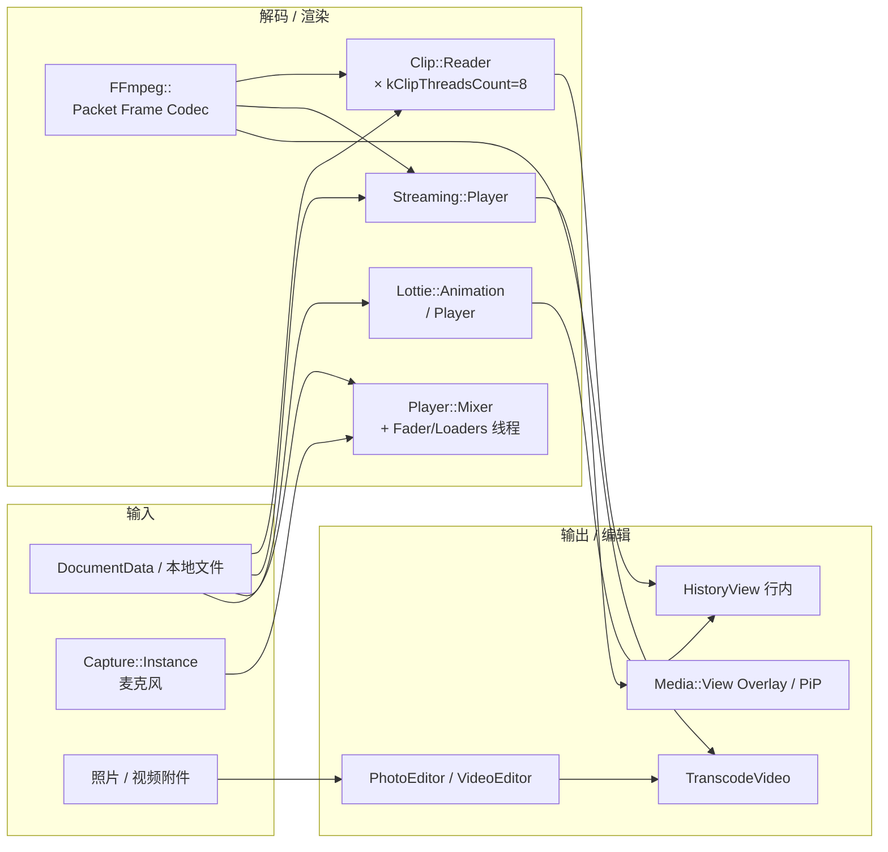

# 18 · 媒体管线：FFmpeg、Lottie、clip 线程、语音/视频消息与编辑器

> 材料：`SourceFiles/ffmpeg/*`、`Telegram/cmake/lib_ffmpeg.cmake`、`media/clip/*`、`media/streaming/*`、`media/audio/*`、`media/player/*`、`media/media_video_encode.*`、`media/view/*`、`editor/*`（含 `editor/video/*`）、`desktop-app/lib_lottie`。行内 History 媒体 unload 见第 [10](10-history-media-memory.md) 章。未逐步跟每一解码错误路径。

## 1. 总览：五条并行管线

| 管线 | 目录 / 库 | 典型用途 |
|---|---|---|
| FFmpeg 工具层 | `ffmpeg/` + `desktop-app::lib_ffmpeg` + `external_ffmpeg` | Packet/Frame/Codec RAII、缩放、通用解码辅助 |
| Clip / GIF | `media/clip/`（`FFMpegReaderImplementation`） | 行内动画、圆形视频预览、GIF |
| Streaming | `media/streaming/` | 大视频/音频边下边播（`Player` + `AudioTrack`/`VideoTrack`） |
| Audio Mixer | `media/audio/` + `media/player/` | 语音消息、音乐、捕获；独立 fader/loader 线程 |
| Lottie | `lib_lottie`（rlottie） | 贴纸/emoji 动画、图标、toast |
| 编辑 / 转码 | `editor/`、`media_video_encode.*` | 照片编辑、视频时间线/质量、发送前 Transcode |



## 2. FFmpeg 封装（`SourceFiles/ffmpeg`）

`Telegram/cmake/lib_ffmpeg.cmake`：`OBJECT` 库 `lib_ffmpeg`，链 `desktop-app::external_ffmpeg`。

`ffmpeg_utility.h` 要点：

- `AvErrorWrap`、`Packet`（移动唯一、持 `AVPacket*`）
- `CodecPointer` / `FramePointer` + deleter
- `MakeCodecPointer`、`FindDecoder`、`PacketPosition` / `PacketDuration`
- `GoodStorageForFrame` / `CreateFrameStorage` → `QImage` 缓冲
- `ffmpeg_frame_generator.*`：通用帧生成；`ffmpeg_bytes_io_wrap.h`：内存 IO

业务解码器（clip / streaming / audio loaders）都经此层，避免到处裸 `av_*`。

## 3. Clip 线程池：`Media::Clip`

### 3.1 线程模型（`media_clip_reader.cpp`）

```text
constexpr kClipThreadsCount = 8;
Workers: vector<unique_ptr<Worker>>
Worker { QThread thread; Manager manager; }  // Manager 住在该线程
```

- 新 `Reader` 分配：未满 8 则扩容；否则选 **`loadLevel()` 最低**的 Worker（或随机）。
- `Reader` 主线程持三槽 `_frames[3]`（show / write / writeNext）；`ReaderPrivate` 在 Worker 线程解码。
- `Manager`（`QObject` 亲和 Worker 线程）调度 `start` / `update` / `deletePrivate`。

### 3.2 实现

- `FFMpegReaderImplementation`：`readFramesTill`、packet 队列、`SwscalePointer`、旋转枚举。
- `PrepareFrame`：主侧按 `FrameRequest` 做 resize / outer / round / colorize。
- `ReaderPointer`：防悬挂的句柄；`Bad()` 哨兵。

与第 10 章衔接：行内 GIF/视频圈在可见时 `start`，滚出后 `stop`，解码负载被 8 线程池限幅。

## 4. Streaming：可 seek 的边下边播

| 类型 | 角色 |
|---|---|
| `Streaming::Document` | 绑定 `DocumentData` + `Loader`（本地或 MTProto） |
| `Streaming::Player` | `FileDelegate`；持 `AudioTrack` + `VideoTrack` |
| `Streaming::Instance` | UI 侧句柄；可 `lockPlayer`；支持 quality/original 双文档 |
| `LoaderMtproto` / `LoaderLocal` | 字节范围供给 |
| `RoundPreview` | 圆形视频预览辅助 |

`Player` 阶段机（头文件 `Stage`）驱动缓冲与播放；可 `setLoaderPriority`；`prepareLegacyState()` 兼容旧 `Media::Player::TrackState`。

大文件内容可落 `Session::cacheBigFile()`（第 16 章），但播放主路径是 Reader 流式读，而非一次 `QByteArray`。

## 5. 语音 / 音乐：`media/audio` + `media/player`

### 5.1 `Player::Mixer`

- 主对象；注释明确 **Thread: Main / Any + AudioMutex** 契约。
- 私有 **`QThread _faderThread`、`_loaderThread`**：`Fader` 与 `Loaders` 搬到后台。
- `Track` 内嵌状态；`play` / 外部播放器流接口；全局 `mixer()` 单例式访问。

### 5.2 捕获

- `Media::Capture::Instance`：自有 `QThread` + `Inner`；语音消息录音。
- `media_audio_edit.*`：波形裁剪等编辑。
- Loaders：`media_audio_ffmpeg_loader` / `child_ffmpeg_loader` / `local_cache`。

### 5.3 UI Player

`media/player/*`：`Instance`、`Widget`、`Panel`、`Float`、音量、listen tracker——壳层控件，真实混音仍回 `Mixer`。

## 6. Lottie（`lib_lottie`）

| 类型 | 角色 |
|---|---|
| `Lottie::Player` | 抽象：帧就绪 / failed 回调 |
| `Lottie::Animation` | 绑定 Player；`frame` / `frameInfo`；支持 multi-cache 与 thread-safe 构造重载 |
| `SinglePlayer` / `MultiPlayer` | 单实例 vs 共享渲染调度 |
| `FrameProvider` / `FrameRenderer` / `SharedState` | 渲染细节（`lottie/details`） |
| `Icon` / `ToastIcon` | 非贴纸场景的轻量动画图标 |

底层依赖 ThirdParty **rlottie**；与 clip 管线分离（矢量动画 vs 光栅视频容器）。

## 7. 编辑器与发送前转码

### 7.1 照片：`editor/photo_editor.*`

- `PhotoEditor : Ui::RpWidget`，模式 `Transform` 等。
- `PhotoEditorContent` + `Controls` + `ColorPicker`；`editor_crop` / `editor_paint`。
- `InitEditorLayer` 嵌入 `Ui::LayerWidget`。

### 7.2 视频：`editor/video/*`

`video_editor.*`、`video_timeline.*`、`video_editor_quality.*`、`video_quality_slider.*`、layer 包装——修剪时间线与质量档。

### 7.3 `Media::TranscodeVideo`（`media_video_encode.h`）

- `VideoSource` / `StillSource`；选项含 `removeAudio` / `silentAudio`。
- `TranscodeResult TranscodeVideo(...)`：发送圆形视频/压缩附件前的 FFmpeg 转码入口。

## 8. 全屏查看与 PiP

`media/view/`：

- `OverlayWidget` + OpenGL / Raster / RHI 后端
- `Pip*` 画中画
- `PlaybackControls` / `Progress` / sponsored
- `VideoStream`：与 **群呼直播流** UI 交叉（第 19 章 `Calls::GroupCall`）

## 9. 小结

- **FFmpeg** 是共享编解码底座；**clip ≤8 线程** 服务行内动画；**streaming** 服务大媒体；**Mixer 双后台线程** 服务语音/音乐。
- **Lottie** 独立 submodule，服务贴纸/emoji 矢量动画。
- **Editor + TranscodeVideo** 在发送路径上裁剪/压缩；查看路径是 Overlay/PiP/Streaming。
- 磁盘缓存边界见第 16 章；行内 RAM unload 见第 10 章。

相关：[`10-history-media-memory.md`](10-history-media-memory.md)、[`16-storage-cache.md`](16-storage-cache.md)、[`13-desktop-app-libs.md`](13-desktop-app-libs.md)、[`19-calls-streaming.md`](19-calls-streaming.md)。
