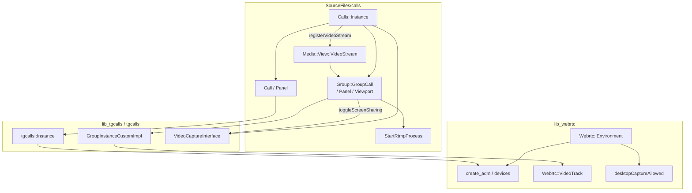

# 19 · 通话与直播：`lib_webrtc`、`tgcalls`、`SourceFiles/calls`

> 材料：`desktop-app/lib_webrtc`（`webrtc_environment.h`、`webrtc_video_track.h`、ADM/设备解析）、`Telegram/cmake/lib_tgcalls.cmake`（`ThirdParty/tgcalls`）、`SourceFiles/calls/*`、`calls/group/*`（含 `calls_group_rtmp.*`、viewport）、`media/view/media_view_video_stream.h`。未逐步跟 tgcalls 内部 ICE/SFU 协议。

## 1. 三层栈

| 层 | 组件 | 角色 |
|---|---|---|
| 产品 UI / 会话 | `Calls::Instance`、`Call`、`GroupCall`、`Panel` | 发起/接听、面板、与 `Main::Session` / MTP 信令 |
| 通话引擎 | `tdesktop::lib_tgcalls` ← `ThirdParty/tgcalls` | `tgcalls::Instance`、`GroupInstanceCustomImpl`、视频采集接口 |
| WebRTC 环境 | `desktop-app::lib_webrtc` | 设备枚举、默认设备、ADM 创建、桌面采集许可、`VideoTrack` |

另：`Calls::WebrtcController`（`calls_controller_webrtc.*`）实现 `Controller`，内部 `Webrtc::CallContext`——1:1 路径上与经典 tgvoip 控制器并列可选（见 `calls_controller_tgvoip.h`）。



## 2. `lib_webrtc`：设备与采集环境

`Webrtc::Environment`：

- `devices` / `defaultId` / `changes` / `forceRefresh`（`DeviceType`×3）
- `desktopCaptureAllowed()`、`uniqueDesktopCaptureSource()`——**屏幕共享前置许可与单源提示**
- `setCaptureMuted` / `CaptureMuteTracker`
- `recordAvailability`（录音能力探测）
- 平台 `EnvironmentDelegate` 回调默认设备与插拔

其它文件：`webrtc_create_adm.*`（Audio Device Module）、`webrtc_device_resolver.*`、`webrtc_audio_input_tester.*`、`webrtc_system_audio_capture.*`、`webrtc_video_track.*`。

群呼/私呼在选设备、切默认麦/扬声器、检测桌面采集时走这一层；真正 RTP 仍在 tgcalls/WebRTC 内核。

## 3. `lib_tgcalls` 组装

`Telegram/cmake/lib_tgcalls.cmake`：

- `add_library(lib_tgcalls STATIC)`，源来自 `${third_party_loc}/tgcalls/tgcalls`
- 含 `group/GroupInstanceCustomImpl.cpp` 等群呼实现
- `tdesktop::lib_tgcalls` alias；链入 Telegram 可执行文件（与第 13 章图谱一致）

产品代码通过 `namespace tgcalls { class Instance; class VideoCaptureInterface; … }` 前向声明耦合，避免 UI 编译期拖入全量 WebRTC 头。

## 4. `Calls::Instance`：进程内通话中枢

头文件可见职责：

| API | 含义 |
|---|---|
| `startOutgoingCall(user, …)` | 发起 1:1 |
| `startOrJoinGroupCall(peer, StartGroupCallArgs)` | 创建或加入群呼；含 `JoinConfirm` |
| `showInfoPanel(Call*/GroupCall*)` | 面板 |
| `currentGroupCall` / `inGroupCall` / `hasVisiblePanel` | 状态查询 |
| `getVideoCapture(…)` | 共享 `tgcalls::VideoCaptureInterface`（`weak_ptr` 缓存 `_videoCapture`） |
| `registerVideoStream(GroupCall*)` | 登记直播/观众流；`_streams` 映射 |
| `applyGroupCallUpdateChecked` | 与 `Data::GroupCall` version 对齐后应用 MTP 更新 |
| `Delegate` | 内部回调桥 |

同时只突出一套 `_currentCallPanel` / `_currentGroupCall` / `_currentGroupCallPanel`（另有 `_startingGroupCall` 过渡）。

## 5. 1:1：`Call` + Controller

- `Calls::Call` 持 tgcalls 状态（`AudioState` / `VideoState`）、emoji fingerprint、信号条等 UI 附件（`calls_signal_bars`、`calls_video_*`）。
- `Controller` 抽象；`WebrtcController` 用 `Webrtc::CallContext`；另保留 `calls_controller_tgvoip.h` 路径。
- 窗口：`calls_window` / `calls_panel` / `calls_top_bar`。

## 6. 群呼：屏幕共享、RTMP、Viewport

### 6.1 `GroupCall` 视频端点

```text
enum VideoEndpointType { Camera, Screen };
struct VideoEndpoint { type, peer, endpoint string … };
```

屏幕共享相关 API（头文件）：

- `isSharingScreen` / `isScreenPaused` / `screenSharingEndpoint` / `screenSharingDeviceId` / `screenSharingWithAudio`
- **`toggleScreenSharing(...)`**、`toggleVideo(bool)`
- 私有：`tryCreateScreencast` / `destroyScreencast`、`setScreenEndpoint`、`setScreenInstanceConnected` / `Mode`
- `emitShareScreenError`——失败路径（权限/设备）
- `broadcastPartStart` / `Cancel`——直播分片加载任务

相机与屏幕是不同 endpoint，可 pin / large 显示（`pinVideoEndpoint`、`showVideoEndpointLarge`）。

### 6.2 RTMP 直播推流入口

`Calls::Group::StartRtmpProcess`：

- `start(peer, show, done→JoinInfo)`：拉 RTMP URL（`requestUrl` / `processUrl`）、展示 box、`FillRtmpRows` 填 UI 行
- `GroupCall::rtmpInfo` / `setRtmpInfo` / `emptyRtmp*`

用于「外部 OBS 等推流进 Telegram 群直播」类场景；与摄像头/屏幕采集并行存在于群呼对象上。

### 6.3 UI：Panel / Viewport / Members

- `calls_group_panel.*`：主面板
- `calls_group_viewport*`（opengl / raster / rhi / tile）：多人视频瓦片
- `calls_group_members*`、菜单、邀请、`ChooseJoinAs`
- `calls_group_messages*`：群呼内文字消息 UI
- 样式：`calls.style`

### 6.4 与媒体查看器交叉：`Media::View::VideoStream`

```text
VideoStream(…, Show, shared_ptr<Data::GroupCall>, …)
  持有 unique_ptr<Calls::GroupCall> _call
  TopVideoStreamDonors(GroupCall*)
```

`Instance::registerVideoStream` 把「观众看直播」路径挂进同一 `GroupCall` 体系，而不是另起一套播放器（与第 18 章 Overlay 目录相邻）。

## 7. 信令与 DC

- 群呼状态机大量依赖 MTP groupCall 更新；`Instance::handleGroupCallUpdate` / `applyGroupCallUpdateChecked`。
- 第 14 章 DC 表：`kGroupCallStreamDcShift = 0x06`——群呼流媒体可走 shifted DC，与普通聊天主 DC 隔离。

## 8. 小结

- **环境**（`lib_webrtc`）管设备/桌面采集许可；**引擎**（`tgcalls`）管连接与编解码；**产品**（`calls/`）管信令、面板与业务（RTMP、加入身份、Stars 等）。
- 屏幕共享 = `VideoEndpointType::Screen` + `toggleScreenSharing` + screencast 实例生命周期；许可先问 `Environment::desktopCaptureAllowed`。
- 直播：RTMP 进程 + `VideoStream` 观众 UI + `registerVideoStream`；广播分片任务挂在 `GroupCall`。
- 1:1 与群呼共享 `getVideoCapture` 弱缓存，避免多路重复开采集。

相关：[`13-desktop-app-libs.md`](13-desktop-app-libs.md)、[`14-api-updates.md`](14-api-updates.md)、[`18-media-pipeline.md`](18-media-pipeline.md)、[`03-mtproto-networking.md`](03-mtproto-networking.md)。
