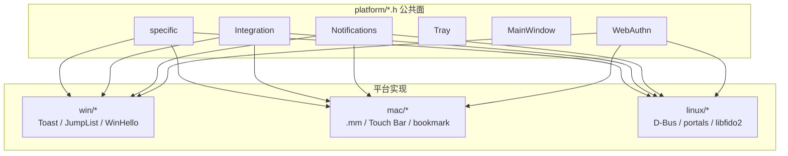

# 20 · 平台层：`SourceFiles/platform`（Win / macOS / Linux）

> 材料：`Telegram/SourceFiles/platform/{platform_*.h,win/,mac/,linux/}`（Contents API + raw）、各平台 `specific_*.h`、`integration_*.h`、`notifications_manager_*.h`、`webauthn_*.{cpp,mm}`、`org.freedesktop.*.xml`。未逐步跟每个 `.mm` 的 Objective-C 回调细节。

## 1. 抽象面：公共头 + `#ifdef` 分流

`platform/` 根目录提供**平台无关声明**，实现按编译宏切到子目录：

| 公共头 | 职责 |
|---|---|
| `platform_specific.h` | `start`/`finish`、权限、自启、托盘、截屏保护、暗色模式探测、`CheckAppTranslocation` |
| `platform_integration.h` | `Integration::Create()` / `Instance()` 进程级钩子 |
| `platform_main_window.h` | 主窗体平台特化入口 |
| `platform_notifications_manager.h` | Toast / 系统通知工厂 |
| `platform_tray.h` | 托盘图标 |
| `platform_window_title.h` | 自定义标题栏 |
| `platform_overlay_widget.h` | 全屏媒体叠加 |
| `platform_file_utilities.h` | 打开/显示文件、下载路径 |
| `platform_file_bookmark.h` | macOS 安全书签（沙盒路径） |
| `platform_webauthn.h` | Passkey 注册/登录 |
| `platform_launcher.h` | 启动参数 / 单实例 |
| `platform_current_geo_location.h` | 定位 |
| `platform_text_recognition.h` / `platform_translate_provider.h` | OCR / 系统翻译 |

分流模式（以 `platform_specific.h` 末尾为例）：

```cpp
#ifdef Q_OS_WIN
#  include "platform/win/specific_win.h"
#elif defined Q_OS_MAC
#  include "platform/mac/specific_mac.h"
#else
#  include "platform/linux/specific_linux.h"
#endif
```

通知、主窗、托盘等同理。产品代码只依赖 `Platform::` 命名空间，避免在业务层写 `#ifdef`。



## 2. 三平台差异表（能力面）

| 能力 | Windows | macOS | Linux |
|---|---|---|---|
| 源码扩展名 | `.cpp` + IDL（Toast/QuietHours） | 大量 `.mm`（ObjC++） | `.cpp` + D-Bus XML |
| 自启 `AutostartSupported` | 是（任务 / 注册表路径） | **否**（头内 `return false`） | 视桌面环境（`.desktop` / portal） |
| `SkipTaskbarSupported` | 是 | **否** | 视 WM |
| `ScreenshotProtectionSupported` | 有实现路径 | 有 | **否**（空实现） |
| App Translocation | 空操作 `return true` | **关键**：`CheckAppTranslocation` + `-untranslocated` | 空操作 |
| 文件书签 | 空 stub | `file_bookmark_mac` + `psPathBookmark` | 空 stub |
| 全局菜单 / Touch Bar | — | `global_menu_mac`、`touchbar/*` | — |
| JumpList / 任务栏按钮 | `windows_*`、`TaskbarButtons` | — | — |
| 通知后端 | WinRT Toast + Activator IDL | UNUserNotification / 旧路径 | `org.freedesktop.Notifications` |
| Flatpak portal | — | — | `org.freedesktop.portal.Flatpak.xml` |
| WebAuthn | `webauthn.dll`，旧系统回落 libfido2 | AuthenticationServices；失败可报 `UnsignedBuild` | Cable + libfido2（`IsSupported()==true`） |
| 地理定位 | Win API | CoreLocation `.mm` | GeoClue 等 |
| 文本识别 | stub / 有限 | Vision `.mm` | stub 头 |

## 3. Windows：`platform/win`

特色模块（Contents 列举）：

- `windows_app_user_model_id.*` — AppUserModelID，影响通知分组与固定任务栏
- `windows_autostart_task.*` — 自启任务
- `windows_taskbar_buttons.*` / JumpList — 缩略图按钮与跳转列表
- `windows_toast_activator.*` + `windows_toastactivator.idl` — Toast 激活 COM
- `windows_quiethours.idl` — 勿扰时段
- `windows_dlls.*` — 延迟加载系统 DLL
- `webauthn_win.cpp` — 优先系统 WebAuthn API

`WindowsIntegration` 继承 `QAbstractNativeEventFilter`，持 `ITaskbarList3` / `ICustomDestinationList`，在 `init()` 里挂原生消息与自定义 JumpList。

## 4. macOS：`platform/mac`

- 几乎全是 `.mm`：通知、主窗、托盘、overlay、文件工具、WebAuthn、翻译/OCR
- `specific_mac_p.h/.mm` — 私有辅助（含 translocation 相关）
- `file_bookmark_mac` — 下载目录等沙盒外路径的安全书签读写（`psDownloadPathBookmark`）
- `touchbar/` — 音频、主会话、媒体查看、固定会话、格式化等 Touch Bar 项
- `global_menu_mac` — 菜单栏全局菜单
- `CheckAppTranslocation()`：从只读 translocation 副本启动时尝试从原路径重启，否则提示用户（见 `kUntranslocatedArgument`）

自启在 macOS 头文件里直接关闭：`AutostartSupported() { return false; }`——与 Win/Linux 产品能力不对齐是刻意的平台取舍。

## 5. Linux：`platform/linux`

- `notifications_manager_linux` + `org.freedesktop.Notifications.xml` — 标准桌面通知
- `org.freedesktop.portal.Flatpak.xml` — Flatpak/Snap 等沙盒下的 portal 能力探测
- `integration_linux` / `specific_linux` — 单实例 socket 清理（`psCheckLocalSocket` 删残留文件）、`linuxMoveFile`
- `ScreenshotProtection*` 全部空实现
- `webauthn_linux.cpp`：默认走 **Cable**（手机扫码），安全密钥走 **libfido2**；`IsSupported()` 恒 `true`
- Snap 构建另见第 22 章：`u2f-devices` plug 与 WebAuthn/安全密钥相关

## 6. 权限与系统设置

`Platform::PermissionType`：`Microphone` / `Camera`。

- `GetPermissionStatus` → `Granted` | `CanRequest` | `Denied`
- `RequestPermission` + 回调
- `OpenSystemSettingsForPermission` / `OpenSystemSettings(Audio)` —— 跳到系统面板

各平台把这些映射到 Win 隐私设置、macOS TCC、Linux portal/PipeWire 等；业务层（通话第 19 章）只问 `Platform::`。

## 7. 和产品其它层的边界

| 需求 | 应落在 |
|---|---|
| 主窗几何、标题栏按钮 | `platform_*` + `window/` |
| 会话列表/历史 UI | `dialogs/` / `history/`（与平台无关） |
| 本地加密盘面 | `storage/` + `lib_storage`（第 16 / 21 章） |
| Passkey 协议与 MTP | `data/components/passkeys` + `Platform::WebAuthn`（第 21 章） |
| 打包沙盒 plugs | `snap/snapcraft.yaml`、Flatpak manifest（第 22 章） |

**要点**：平台层是「操作系统适配器」，用公共头把 Win/macOS/Linux 差异关进子目录；新增桌面能力时优先扩 `platform_*.h` 契约，而不是在 `data/` / `history/` 里散落 `#ifdef`。
