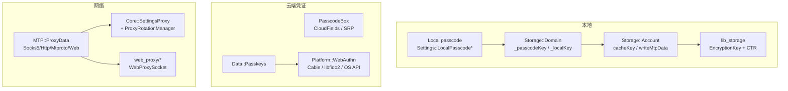
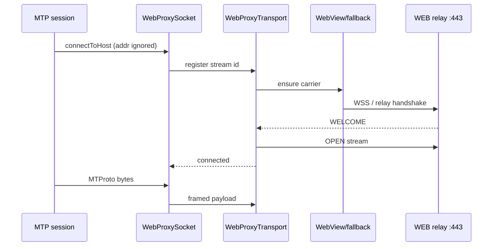

# 21 · 安全相关表面：本地加密、passcode、WebAuthn/passkeys、代理（含 WEB proxy）

> 材料：`Storage::Domain` / `Storage::Account`、`lib_storage`（`EncryptionKey` / `EncryptedFile` / CTR）、`boxes/passcode_box`、`settings_local_passcode`、`window_unlock_passcode_box`、`data/components/passkeys`、`platform_webauthn` + `webauthn/*`、`MTP::ProxyData`、`Core::SettingsProxy`、`mtproto/web_proxy/*`、`docs/web-proxy-plan.md`。不涉及攻击利用步骤；不复述密钥材料。

## 1. 总览：四条安全相关面

| 面 | 保护对象 | 关键类型 |
|---|---|---|
| 本地盘面加密 | 账号 map、缓存 DB、设置 blob | 用户本地 passcode → 派生 `_localKey` |
| 云密码 / 2FA | 账号敏感操作、Passport 等 | `PasscodeBox` + `Core::CloudPassword*` / MTP |
| Passkeys | 登录与密钥注册 | `Data::Passkeys` + `Platform::WebAuthn` |
| 代理 | 出站 MTProto 可达性 | Socks5 / HTTP / MTProto / **Web** |



## 2. 本地加密与 Local Passcode

### 2.1 `Storage::Domain`：passcode → local key

`storage_domain.h` 可见状态机：

- `start(passcode)` → `StartResult::{Success, IncorrectPasscode, IncorrectPasscodeLegacy}`
- `checkPasscode` / `setPasscode` / `hasLocalPasscode`
- 私有：`generateLocalKey()`、`encryptLocalKey(passcode)`、`_localKey`、`_passcodeKey`、`_passcodeKeySalt`、`_passcodeKeyEncrypted`

多账号共用 Domain 级本地密钥；各 `Storage::Account` 用该 key 打开 map 与缓存。

### 2.2 `lib_storage` 原语

| 类型 | 要点 |
|---|---|
| `EncryptionKey` | `kSize=256` / `kSize_v2=64`；`prepareCtrState(salt)` |
| `CtrState` | AES-CTR：`kKeySize=32`、`kIvSize=16`、按 block offset 加解密 |
| `Storage::File`（EncryptedFile） | `open(path, mode, key)` → `WrongKey` / `LockFailed` / `Success`；读写带 padding |

`Storage::Account::cacheKey()` / `cacheBigFileKey()` 把同一套密钥交给第 16 章的 `Cache::Database::open(EncryptionKey&&)`。

### 2.3 UI 入口

| 组件 | 作用 |
|---|---|
| `Settings::LocalPasscodeCreateId/CheckId/ManageId` | 设置页：创建 / 校验 / 管理本地锁 |
| `Window::ShowUnlockPasscodeBox` | 应用已锁时弹窗；解锁后跑 `unlocked` 回调 |
| 资源 | `local_passcode_enter.tgs`、指纹/Watch/WinHello 菜单图标 |

**注意**：本地 passcode **不是** Telegram 云端两步验证密码；关掉本地锁只影响本机盘面加密口令，不影响 `account.password`。

## 3. 云密码：`PasscodeBox`

`boxes/passcode_box.h` 同时服务：

- 打开/关闭云密码（`turningOff`）
- 带 `CloudFields`（SRP `curRequest`、`newAlgo`、recovery、Passport 非空提示、`pendingResetDate`）
- `CustomCheck`：用云密码门控敏感操作（导出、删除账号等）

产出信号：`newPasswordSet`、`newAuthorization`、`passwordReloadNeeded`。算法细节在 `core/core_cloud_password.*`（与官方 SRP 方案对齐）；本章只标边界。

## 4. WebAuthn / Passkeys

### 4.1 产品层 `Data::Passkeys`

- `PasskeyEntry`：`id` / `name` / `date` / `softwareEmojiId` / `lastUsageDate`
- `initRegistration` → 平台 `RegisterKey` → `registerPasskey`
- `deletePasskey`、`requestList` / `list`
- 登录路径：`InitPasskeyLogin` / `FinishPasskeyLogin`（MTP + `Platform::WebAuthn::LoginResult`）

设置 UI：`settings/sections/settings_passkeys.*`；反序列化：`data_passkey_deserialize.*`。

### 4.2 平台 `Platform::WebAuthn`

公共 API（`platform_webauthn.h`）：

- `IsSupported()`
- `RegisterKey` / `Login` → `RegisterResult` / `LoginResult`
- `Error::{None, Cancelled, UnsignedBuild, Other}`

`webauthn_common.h` 注明安全密钥分支：

| 平台 | 主路径 | 安全密钥 |
|---|---|---|
| Linux | Cable（扫码） | libfido2 |
| macOS | AuthenticationServices；错误可映射 `UnsignedBuild` | libfido2 |
| Windows | OS `webauthn.dll`（若有） | 旧系统回落 libfido2 |

共享实现：`webauthn/cable_*`（隧道、扫码器分平台）、`RegisterViaLibfido2` / `LoginViaLibfido2`。Snap 声明 `u2f-devices` plug，与安全密钥访问相关。

## 5. 代理：Socks5 / HTTP / MTProto / Web

### 5.1 数据模型 `MTP::ProxyData`

```text
Type: None | Socks5 | Http | Mtproto | Web
Settings: System | Enabled | Disabled
字段: host, port, user, password (+ resolvedIPs)
```

- `ValidMtprotoPassword` / `secretFromMtprotoPassword` — MTProxy / WEB 共用 secret 语法
- `supportsCalls()` — WEB 等类型对通话有限制
- `NormalizeWebProxyHost` / `WebProxyBridgeCapability` — WEB 主机名规范化与能力串
- `ToNetworkProxy` — 映射到 `QNetworkProxy`（WEB 对 Qt 应用代理为 `NoProxy`）

### 5.2 设置与轮换

`Core::SettingsProxy`：

- 列表 CRUD、`selected`、`settings`（System/Enabled/Disabled）
- `tryIPv6`、`useProxyForCalls`
- **轮换**：`proxyRotationEnabled`、超时档位 `{5,10,15,30,60}` 秒（默认 10）、`proxyRotationPreferredIndices`
- 序列化进本地设置

`core/proxy_rotation_manager.*` 按超时在候选间切换；WEB 条目在 v1 **不参与后台探测**（避免为每个保存的 WEB 代理拉起 WebView carrier）。

### 5.3 WEB proxy（深潜入口）

上游设计文档：`docs/web-proxy-plan.md`。实现落点：

| 路径 | 角色 |
|---|---|
| `mtproto/details/mtproto_web_proxy_socket.*` | `AbstractSocket`：逻辑字节流，忽略实地址，分配 24-bit stream id |
| `mtproto/web_proxy/web_proxy_transport.*` | 共享传输、WELCOME/OPEN 帧 |
| `web_proxy_frame.*` | 帧编解码 |
| `web_proxy_webview.*` | WebView / 浏览器回落 carrier |

要点（与 plan 一致、可核验）：

- 类型码序列化为 `4`；`host`=IDNA A-label，`port` 固定 **443**，`password`=MTProxy secret；`ee` TLS-emulation secret **拒绝**
- 导入链接：`tg://webproxy` / `https://t.me/webproxy`（无 `tg://proxy?…` 形式）
- DC 端点忽略：由托管 relay 固定打到 stock MTProxy；通话不支持
- `initConnection` 上报 relay 主机名与 443



## 6. 与其它章的交叉引用

- 缓存加密与 eviction → 第 16 章
- MTProto 连接 / DC → 第 03 / 14 章
- 平台 WebAuthn 实现差异 → 第 20 章
- 官方包签名与更新清单校验 → 第 22 章（`writeUpdateManifest` / `sign_update.py`）

**要点**：本地 passcode 护的是**本机密钥与缓存**；云密码与 passkeys 护的是**账号凭证路径**；代理（尤其 WEB）护的是**可达性与审查绕过面**——三者密钥与威胁模型不要混谈。
