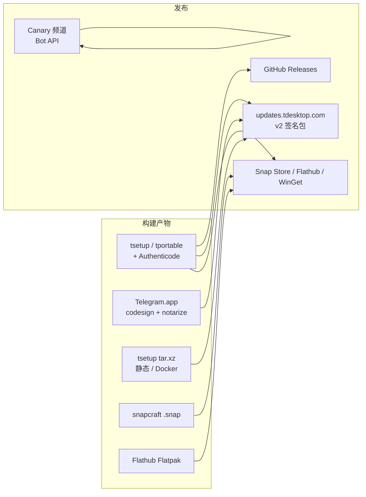

# 22 · 打包与分发：Snap / Flatpak / 官方安装包 / 签名与更新通道

> 材料：上游 `README.md` 下载表、`snap/snapcraft.yaml`、`lib/xdg/org.telegram.desktop.metainfo.xml`、`Telegram/build/{build.sh,build.bat,setup.iss,sign_update.py,updates.py,version,docker/}`、`.github/workflows/{snap,linux,mac,win,winget,canary,docker,master_updater}.yml`。Flatpak 官方构建清单在 Flathub（本仓仅 portal XML + metainfo），未克隆 flathub 仓。

## 1. 用户可见分发面（README）

| 通道 | 入口 |
|---|---|
| Windows 64 / 32 + portable | `telegram.org/dl/desktop/win64` 等 |
| macOS 10.13+ | `…/mac` |
| Linux 64-bit 静态包 | `…/linux` |
| Snap | [snapcraft.io/telegram-desktop](https://snapcraft.io/telegram-desktop) |
| Flatpak | [flathub.org/…/org.telegram.desktop](https://flathub.org/apps/details/org.telegram.desktop) |
| WinGet | workflow `winget.yml` → `Telegram.TelegramDesktop` / `.Beta` |

旧系统停更版本见第 00 章表（4.9.9 / 2.4.4 / 1.8.15）。



## 2. Snap（仓内一等公民）

`snap/snapcraft.yaml` 要点：

| 项 | 值 |
|---|---|
| `base` | `core24` |
| `confinement` | `strict` |
| `compression` | `lzo` |
| app id | `org.telegram.desktop` → 命令 `telegram-desktop` |
| 扩展 | `gnome` |
| 关键 plugs | `home`、`network`、`network-bind`、`audio-*`、`camera`、`removable-media`、`u2f-devices`、`bluez`… |
| slots | `mpris` |
| 构建 | CMake Ninja Release；依赖 parts：`qt`、`ffmpeg`、`webrtc`、`tde2e`、`openal`… |
| 版本 | 读 `Telegram/build/version` 的 `AppVersionStr` + `BetaChannel` + `git describe` |
| 后处理 | `minidebug.sh`；二进制 `Telegram` → `telegram-desktop`；图标改 `snap.*` 前缀 |

CI：`.github/workflows/snap.yml`（Ubuntu / Depot runner，`UPLOAD_ARTIFACT`）。路径忽略策略与 `linux.yml` 类似，但**专门为 snap 树触发**。

## 3. Flatpak

- 本仓 **无** 完整 Flatpak manifest；用户安装走 **Flathub** `org.telegram.desktop`
- 仓内支撑：
  - `lib/xdg/org.telegram.desktop.metainfo.xml` — AppStream（`project_license` GPL-3.0、截图、关键词、`display_length≥480`）
  - `platform/linux/org.freedesktop.portal.Flatpak.xml` — 运行时 portal 接口
  - `Telegram/build/changelog2appstream.py` — changelog → AppStream 转换辅助

与 Snap 同属沙盒分发；权限模型以 Flathub 清单为准，分析时需对照外部仓。

## 4. 官方平台包与构建脚本

| 平台 | 脚本 / 工程 | 产物印象 |
|---|---|---|
| Windows | `build.bat`、`setup.iss`（Inno Setup）、`test_package.bat` | `tsetup*.exe`、`tportable*.zip` |
| macOS | `build.sh`、`updates.py`、`mac_store_upload.sh` | `.app` / `.dmg`；`codesign --options runtime` + Developer ID |
| Linux | `build.sh` + `docker/centos_env` | 静态 `tsetup*.tar.xz`；CI 镜像 `ghcr.io/…/centos_env` |

`Telegram/build/version`（拉取时示例）：`AppVersionStr=7.2.5`、`BetaChannel=0`——**可能领先** GitHub Releases tag；已发布以 Releases 为准（见系列 README）。

`updates.py`（macOS 路径）可见：strip → `codesign … Developer ID Application: Telegram FZ-LLC (C67CF9S4VU)` → 检查 `Updater` / `crashpad_handler` / `_CodeSignature` → 打更新目录。

## 5. 签名与更新通道

### 5.1 更新包签名 `sign_update.py`

- 服务 **v2 update packer**：`-emit-signing-input` → 本脚本签 SHA-256 → 嵌入 raw `r||s`（ES256，64 字节）
- 生产：Azure Key Vault REST + `az` token
- 本地测试：openssl 子进程
- Ed25519：**不经**本脚本，由 packer `-local-key` 进程内签
- `--check`：长编译前校验 vault/会话，避免编完才失败

本地侧持久化：`Local::writeUpdateManifest(manifest, signature)` / `readUpdateManifest`（`localstorage.h`）。

### 5.2 通道分层

| 通道 | 触发 / 机制 |
|---|---|
| 稳定正式版 | GitHub `release: released`；WinGet `Telegram.TelegramDesktop` |
| Beta / prerelease | WinGet `Telegram.TelegramDesktop.Beta`；`BetaChannel≠0` 时 Snap 版本后缀 `-beta` |
| 官方自动更新 CDN | `updates.tdesktop.com`（README 旧版直链同域） |
| Canary | `canary.yml`：`public-canary` / `private-canary`；Azure ES256 + DigiCert KeyLocker（Win）+ Apple notarize；经 Bot API 发频道 |
| Nightly / tag CI | `linux/mac/win.yml` 在 tag / `nightly` 分支用 Depot 大机 |

### 5.3 WinGet

```yaml
# winget.yml（摘要）
on.release: [released, prereleased]
identifier: Telegram.TelegramDesktop        # released
identifier: Telegram.TelegramDesktop.Beta   # prereleased
installers-regex: 't(setup|portable).*(exe|zip)$'
```

## 6. Docker 构建环境

`.github/workflows/docker.yml`：仅当推送到**默认分支**且改动 `Telegram/build/docker/centos_env/**` 时，用 Poetry 生成 Dockerfile，构建并推送：

`ghcr.io/<repo>/centos_env:latest`

Linux 官方静态包与 `linux.yml`（Rocky Linux 8 矩阵）依赖此环境；与 Snap 的 `core24` 用户态是两条线。

## 7. 和开发者自建包的边界

自建（第 24 章 API 凭证）≠ 官方签名通道：

- 官方更新验签公钥 / Key Vault 密钥不会进普通 fork
- Snap 清单里可见一组 **官方 Snap 用** `TDESKTOP_API_ID/HASH`——自建务必换自己的（见 `docs/api_credentials.md`）
- `UnsignedBuild` 在 macOS WebAuthn 路径上可能直接失败（第 21 章）

**要点**：分发是「多轨」——商店沙盒（Snap/Flatpak/WinGet）、官方安装包 + v2 签名更新、以及 Canary 实验轨；分析更新安全时盯 `sign_update.py` + manifest，而不是只看 GitHub Releases 资产表。
