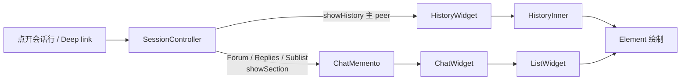
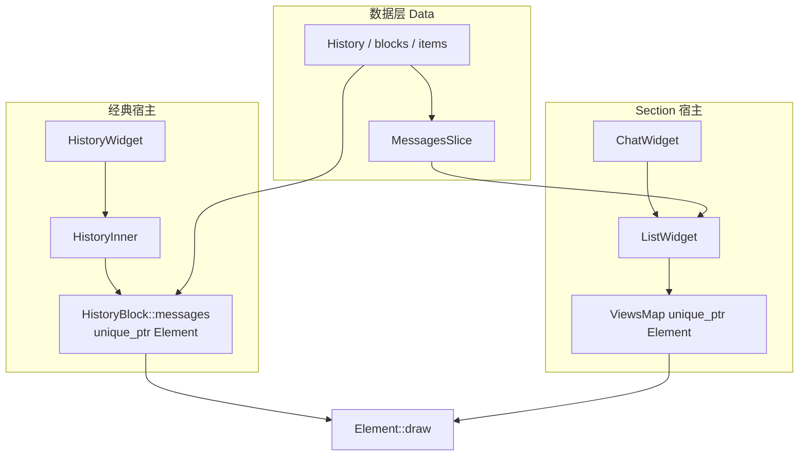

# 25 · 双宿主：HistoryWidget/HistoryInner vs ChatWidget/ListWidget

> 基于 `dev`：`history_widget.*`、`history_inner_widget.*`、`history/view/history_view_chat_section.*`、`history_view_list_widget.*`、`history_view_element.*`、`window_session_controller.*`（raw / Contents）。承接 [07](07-history-structure-entry.md)–[11](11-history-updates-jank.md)；**未**穷尽所有 `showSection` 分支。推测处已标注。

同一套 `HistoryItem` 数据，在 UI 上却有两条「消息流宿主」：**经典中栏** `HistoryWidget` + `HistoryInner`，与 **Section 形态** `HistoryView::ChatWidget` + `ListWidget`。二者共享 `Element` 绘制模型，但 **行视图所有权、滚动锚点、切片数据源** 不同。搞清「何时走哪条」是读 07–11 的总图。

## 1. 代码落点

| 路径 | 角色 |
|---|---|
| `history/history_widget.*` | 主中栏：打开 peer、compose、经典 list 宿主 |
| `history/history_inner_widget.*` | 直接遍历 `History::blocks` 绘制 |
| `history/view/history_view_chat_section.*` | `ChatWidget` / `ChatMemento` / `ChatViewId` |
| `history/view/history_view_list_widget.*` | `ListWidget` + `ListDelegate` + `ViewsMap` |
| `history/view/history_view_element.*` | 共享 `Element` / `ElementDelegate` |
| `window/window_session_controller.*` | `showHistory` vs `showSection(ChatMemento)` 分流 |
| `mainwidget.h`（见 [04](04-dialogs-chat-list.md)） | 并列持有 Dialogs 与 `HistoryWidget` |

## 2. 何时走哪条路径

| 场景 | 入口（可核对） | 宿主 |
|---|---|---|
| 普通私聊 / 群 / 频道主时间线 | `SessionController::showHistory` → `content()->showHistory` → `HistoryWidget::showHistory` | **HistoryWidget + HistoryInner** |
| Forum topic | `showForumTopic` 等 → `ChatMemento(ChatViewId{…, repliesRootId})` → `showSection` | **ChatWidget + ListWidget**（`Mode::Replies`，topic） |
| 评论串 / replies | `ChatMemento::Comments()` 或带 `repliesRootId` | **ChatWidget**（`Mode::Replies`） |
| Saved Messages 子列表 | `ChatViewId.sublist` | **ChatWidget**（`Mode::Sublist`） |
| 定时消息 | `ScheduledMemento`（独立 Section，非本章双宿主核心） | 另章；compose 草稿键见 [26](26-compose-send-path.md) |

`ChatWidget::Mode`（头文件可见）：`Sublist` / `Replies` / `History`。  
其中 `Mode::History` 出现在 support 模式等「仍用 ChatWidget 画主时间线」的边角（`chat_section.cpp` 可见 `mode() == Mode::History && !_topic` 分支）——**〔推测〕** 产品默认主路径仍是 `HistoryWidget`，`Mode::History` 不是日常点开会话的主入口。

## 3. 共享：`Element` 与 `HistoryItem`

- 数据：`HistoryItem` 由 `Data::Session` / `History` 拥有（见 [08](08-history-data-pagination.md)）。
- 视图：`HistoryItem::createView(ElementDelegate*)` → `unique_ptr<Element>`；`mainView()` / `setMainView` 登记「主视图」指针。
- Delegate：`HistoryInner` 与 `ListWidget` **都**实现庞大的 `ElementDelegate` / `element*` 接口（未读样式、reply 隐藏、author rank、chat mode 等）。
- **所有权分叉**：
  - **经典路径**：Element 挂在 `HistoryBlock::messages`（`deque`/`vector` of `unique_ptr<Element>`），Inner 遍历 blocks。
  - **ListWidget 路径**：`ViewsMap = flat_map<HistoryItem*, unique_ptr<Element>> _views`（另有 `_viewsCapacity`）；可见行进 `_items`；数据窗口来自 `Data::MessagesSlice _slice`（经 `ListDelegate::listSource`）。

换 peer / 卸载时，经典路径经 `unloadHeavyViewParts(delegate)`（[10](10-history-media-memory.md)）；ListWidget 则销毁/收缩 `_views` 条目——**同一 Item 不应同时被两套宿主各持一个「主」Element 当活视图**（`mainView` 单指针语义）；**〔推测〕** 同时打开同 peer 的主栏与 replies 时，replies 侧 Element 可能非 `mainView`，需在双开场景再核对。

## 4. 滚动锚点与记忆体

| | HistoryInner | ListWidget |
|---|---|---|
| 锚点 | `History::scrollTopItem` + `scrollTopOffset` | `ListMemento::ScrollTopState{item, shift}`；另有 `listScrollTopItemId/Date/Shift` 字段注释 |
| 数据窗口 | 本地 `blocks` 填满策略 | `_slice` + 上下预取，不要求整段 blocks |
| 换页记忆 | 绑在 `History` 公开字段 | `ChatMemento` 内嵌 `ListMemento _list`；`saveState` / `restoreState` |
| 几何 API | `itemTop` / `viewByItem` / `scrollToElementLocalY` | `viewByPosition` / `scrollTopForView` / `lookupItemByY` |

这解释了 [09](09-history-layout-virtualization.md) 为何强调「经典锚点」与「新 List 锚点」两套词汇：不是两套产品，而是 **双宿主并存期的 API 分叉**。

## 5. Compose / Chrome 谁挂

- `HistoryWidget`：自带 TopBar、`ComposeControls`、CornerButtons、Pinned/GroupCall/Translate 等条带（07 已列）。
- `ChatWidget`：`setupComposeControls()`；成员 `unique_ptr<ComposeControls> _composeControls` + `QPointer<ListWidget> _inner` + `unique_ptr<ElasticScroll> _scroll`。
- 发送 / 草稿路径两端都走同一套 `ComposeControls` + `ApiWrap::sendMessage`（见 [26](26-compose-send-path.md)）——**输入条是共享组件，列表宿主不是**。

## 6. 迁移 / 所有权心智模型（读码顺序）

1. **产品入口**：先看 `SessionController` 调的是 `showHistory` 还是 `showSection(ChatMemento)`。
2. **数据**：始终落到同一个 `History` / `HistoryItem`（topic 另有 `ForumTopic` / replies list）。
3. **视图**：看 Element 的 `unique_ptr` 落在 `HistoryBlock` 还是 `ListWidget::_views`。
4. **生命周期**：换 peer 时经典路径 `takeWidget<HistoryInner>().destroy()` 再 `setOwnedWidget`（07 已核对）；Section 路径靠 memento 保存/恢复 List 状态，销毁 Section 即拆 `ChatWidget`。

## 7. 与 07–11 的交叉索引

| 章 | 本章补什么 |
|---|---|
| [07](07-history-structure-entry.md) | 07 已画双宿主树；本章钉死 **分流条件** 与 Mode |
| [08](08-history-data-pagination.md) | 分页/Gap 在两宿主上最终都进 `History`；List 多一层 Slice |
| [09](09-history-layout-virtualization.md) | 锚点字段分叉的原因 = 双宿主 |
| [10](10-history-media-memory.md) | unload 按 **delegate** 走；换宿主 = 换 delegate |
| [11](11-history-updates-jank.md) | `newItemAdded`/reveal 在 Inner vs List 的插入点不同，动画入口仍可汇合到 sendingAnimation（26） |

## 8. 小结

- **默认点开会话** → `HistoryWidget` + `HistoryInner`。
- **Topic / 评论 / Saved 子列表** → `ChatWidget` + `ListWidget`（`ChatMemento`）。
- **共享** Element 绘制与 Compose；**不共享** 行缓存容器与滚动锚点存储。
- 读码时先定宿主，再跟 Element 所有权，避免把 `scrollTopItem` 与 `ListMemento` 混为一谈。

相关：[07](07-history-structure-entry.md)–[11](11-history-updates-jank.md)、[26](26-compose-send-path.md)、[15](15-ui-system.md)。
