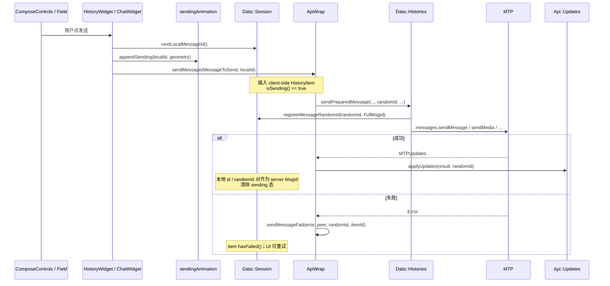

# 26 · 发送路径：Compose、草稿、动画、local id → server id

> 基于 `dev`：`history/view/controls/history_view_compose_controls.*`、`compose_controls_common.h`、`data/data_drafts.*`、`apiwrap.h`（`sendMessage` / `sendMessageFail`）、`api/api_sending.*`、`data/data_histories.*`（`sendPreparedMessage`）、`history_widget.cpp` 发送段。推测处已标注。

从输入框到「气泡出现在列表底部」不是一次 RPC，而是：**草稿落盘 → 分配本地 MsgId → 可选发送动画 → MTP 发出 → `applyUpdates(randomId)` 把本地条替换/对齐为服务器 id → 失败标红可重试**。

## 1. 代码落点

| 路径 | 角色 |
|---|---|
| `history/view/controls/history_view_compose_controls.*` | 输入条总成：field、发送键、语音条、草稿 apply/save |
| `…/compose_controls_common.h` | `SetHistoryArgs`、`VoiceToSend`、`WriteRestriction` 等 |
| `data/data_drafts.*` | `Draft` / `DraftKey` / `WebPageDraft`；云草稿 Apply/Clear |
| `apiwrap.*` | `sendMessage(MessageToSend, optional localMessageId)`、`sendMessageFail` |
| `api/api_sending.*` | `SendExistingDocument/Photo`、Dice、Location、Venue、`SendConfirmedFile` |
| `api/api_send_progress.*` | typing / upload 进度类 sendAction |
| `data/data_histories.*` | `sendPreparedMessage`：串行发送队列 + `randomId` |
| `data/data_session.*` | `nextLocalMessageId`、`registerMessageRandomId` |
| `window` / `Ui::MessageSendingAnimation*` | `controller()->sendingAnimation().appendSending` |

`HistoryWidget` 与 `ChatWidget` 都持有 / 组装 `ComposeControls`（见 [25](25-history-dual-hosts.md)）。

## 2. Compose 条结构（心智）

`ComposeControls`（头文件可见能力摘录）：

- `setHistory(SetHistoryArgs)`：绑定当前 `History` / topic / 限制条件。
- 草稿：`applyCloudDraft` / `applyDraft` / `saveFieldToHistoryLocalDraft`。
- 编辑 / 回复 / 转发：`editMessage`、`replyToMessage`、`updateForwarding`、`cancel*`。
- 发送周边：`initSendButton`、语音 `VoiceRecordBar`、`SendAs`、静音、TTL、AI 按钮等。
- 模式：`ComposeControlsMode`（Normal 等）；`WriteRestriction` 控制只读/慢速等。

Field 文本变更会驱动本地草稿保存；云草稿由 `Data::ApplyPeerCloudDraft` 等从 Updates/API 灌入（`data_drafts.h`）。

### `DraftKey` 分区（避免串稿）

同一 `History` 上多把钥匙：`Local(topic…)` / `LocalEdit` / `Cloud(topic…)` / `Scheduled` / `ScheduledEdit` / `WelcomeMessages*` / `Shortcut*`。  
换 topic、进定时消息 Section、或编辑态，用的不是同一 key——这是「切回来字还在」与「不会把编辑稿写进普通草稿」的根。

## 3. 发送时序（文本主路径）

`HistoryWidget` 发送段可核对要点：

1. `nextLocalMessageId = session().data().nextLocalMessageId()`。
2. 若字段几何适合，调用 `sendingAnimation().appendSending({ Type::Text, localId, globalStartGeometry })`——从输入框飞向气泡位。
3. `session().api().sendMessage(std::move(message), nextLocalMessageId)`。
4. 清空 field、`saveDraftWithTextNow`、刷新 history（`HistoryUpdate::Flag::MessageSent` 或 ScheduledSent）。

媒体 / 已有文档走 `Api::SendExistingDocument/Photo(..., localMessageId)` 或 `sendExistingDocument` 包装；GIF 带 caption 也会先 `appendSending(from)` 再带上 `from.localId`。

## 4. `randomId`、本地 id、队列

- **本地 MsgId**：客户端预分配，立刻进列表（乐观 UI）；`HistoryItem::isSending()` / `hasFailed()` 区分态（`data_histories.cpp` 删除/清理路径可见）。
- **randomId**：`base::RandomValue<uint64>()`，经 `registerMessageRandomId` 挂到 `FullMsgId`；成功回包 `applyUpdates(..., randomId)` 做关联。
- **`Histories::sendPreparedMessage`**：
  - 按 history 串行（`afterRequest(history->sendRequestId)`），避免同会话乱序压垮。
  - 若 topic 仍在 creating：请求进 `_creatingTopics` 队列，topic 建成后再 `sendPreparedMessage` 冲刷；同时改写 `clientSideMessages` 上的 topicRootId。
- **失败**：`ApiWrap::sendMessageFail(MTP::Error|QString, peer, randomId, itemId)`——具体重试 UI（点气泡重发）在 history 控件内；**〔推测〕** 重试复用同一 local item 再走一遍 sendPrepared，而非新建 id（需在 fail 处理分支逐行确认）。

## 5. 动画与列表插入

- `appendSending` 登记「从哪块屏幕矩形飞出」；列表侧 reveal / `newItemAdded`（[11](11-history-updates-jank.md)）负责高度展开。
- 慢速模式：`latestSendingMessage()` 非空时可挡住连发（`history_widget.cpp` 可见判断）。
- Scheduled：options 带 scheduled 时更新 Flag 不同，草稿键用 `DraftKey::Scheduled()`（controller 里 `Section::Scheduled` 分支）。

## 6. 与双宿主的关系

| | HistoryWidget | ChatWidget |
|---|---|---|
| Compose | 内建 / 成员 | `_composeControls` |
| 发送入口 | `prepareSendAction` + `api().sendMessage` | 同系 Compose + Api |
| 列表落点 | HistoryInner / blocks | ListWidget / `_views` |
| 动画 | 同一 `SessionController::sendingAnimation()` | 同 |

乐观 Item 进的是 **数据层** `History`；两个宿主只是之后怎么画 Element。

## 7. 小结

- Compose = 共享输入组件；草稿用 `DraftKey` 按场景分槽。
- 发送 = **local MsgId（乐观）+ randomId（关联）+ Histories 串行队列**。
- 成功靠 `applyUpdates(..., randomId)` 对齐 server id；失败走 `sendMessageFail` + `hasFailed`。
- 飞入动画与 reveal 动画分层：前者几何飞射，后者列表高度。

相关：[25](25-history-dual-hosts.md)、[07](07-history-structure-entry.md)、[08](08-history-data-pagination.md)、[11](11-history-updates-jank.md)、[14](14-api-updates.md)。
