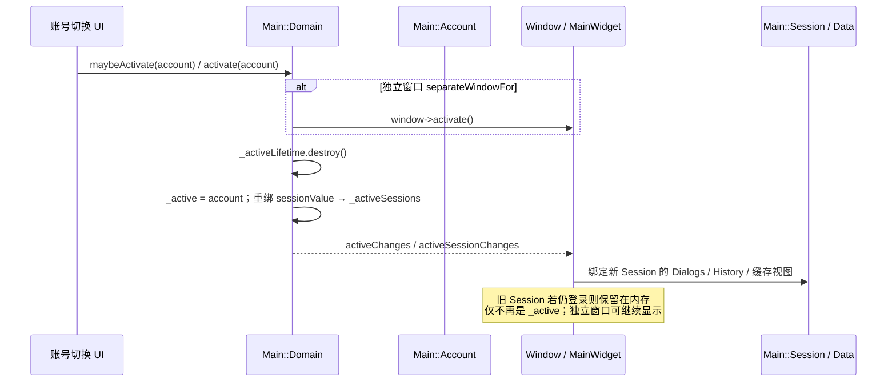
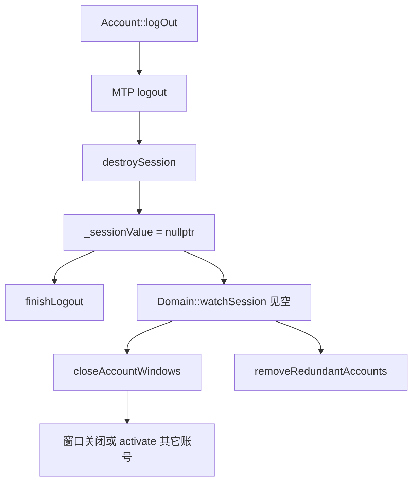

# 27 · 多账号：Main::Domain / Account、本地密钥、切换与拆栈

> 基于 `dev`：`main/main_domain.*`、`main/main_account.*`、`storage/storage_domain.*`、`storage/storage_account.h`、以及 `Main::Session` 持有关系（见 [14](14-api-updates.md)/[16](16-storage-cache.md)）。**未**跟完每个窗口对 `activeChanges` 的订阅清单。推测处已标注。

tdesktop 多账号不是「同一个 `Data::Session` 里换 userId」，而是 **`Main::Domain` 拥有多个 `Main::Account`，每个 Account 自带 MTP 实例与（可选）完整 `Main::Session`**。切换账号 = 改 `_active` + 让 UI 跟着 `activeSession*` 重建/隐藏列表与历史；登出 = `destroySession` 拆掉该账号的数据中枢。

## 1. 代码落点

| 路径 | 角色 |
|---|---|
| `main/main_domain.*` | 账号表、`activate`、未读徽章汇总、上限 |
| `main/main_account.*` | 单账号：MTP、`createSession` / `destroySession`、登出 |
| `storage/storage_domain.*` | Domain 级本地密钥 / passcode、账号列表落盘 |
| `storage/storage_account.*` | 单账号本地存储（map、草稿、缓存路径等） |
| `main/main_session.*` | 业务会话：`ApiWrap`、`Api::Updates`、`Data::Session` |
| `core/application`（调用方） | `separateWindowFor(account)`、passcode 锁 |

## 2. 对象树

```text
Main::Domain                    // kMaxAccounts=3；Premium → kPremiumMaxAccounts=6
  ├─ Storage::Domain _local     // _localKey / passcodeKey / writeAccounts
  └─ vector<AccountWithIndex>
        └─ Main::Account
              ├─ Storage::Account _local
              ├─ MTP::Instance _mtp
              └─ unique_ptr<Session> _session   // 未登录可为空
                    ├─ ApiWrap / Api::Updates
                    └─ Data::Session            // Dialogs / History / 缓存入口
```

公开流：`activeValue` / `activeChanges`、`activeSessionValue` / `activeSessionChanges`、`accountsChanges`。  
未读：`Domain::unreadBadge()` 汇总各已登录 Account 的 `session().data()` 徽章（`watchSession` 订阅 `unreadBadgeChanges`）。

## 3. 本地密钥与启动

`Storage::Domain`：

- `start(passcode)` → `StartResult::{Success, IncorrectPasscode, IncorrectPasscodeLegacy}`。
- `generateLocalKey` / `encryptLocalKey(passcode)`；成员 `_localKey`、`_passcodeKey` + salt/encrypted blob。
- `hasLocalPasscode` / `checkPasscode` / `setPasscode`；空账号集时可清 passcode（`Domain::removePasscodeIfEmpty` → `Local::reset`）。

`Main::Account` 启动链（头文件）：`legacyStart` / `prepareToStart(localKey)` / `start(config)` → 需要时 `createSession(MTPUser|serialized…)`。  
每个 Account 有独立 `dataName` + `index`；**〔推测〕** 磁盘目录按 index/dataName 隔离 map 与 media cache，故切换账号不会共用同一 `Data::Session` 内存图（与 [16](16-storage-cache.md) 边界一致）。

## 4. 切换账号：`activate`



要点（`main_domain.cpp` 可核对）：

1. `activate`：若已是 `_active` 则只确保窗口激活；否则切换 `_accountToActivate`、重置 `_activeLifetime`、把新 account 的 `sessionValue` pipe 到 `_activeSessions`。
2. `maybeActivate`：有独立窗口则直接 `activate`；否则 `preventOrInvoke` 再激活（避开模态框中途切账号）。
3. **不是**在 `activate` 里立刻 `destroySession`——未登出的账号 Session 仍活着；拆的是「谁算当前 Domain 活动账号」与窗口焦点。
4. `closeAccountWindows`：某账号 Session 变为空（登出）时，关掉该账号窗口或 `activate(another)` 落到其它账号。

## 5. 登出 / 拆栈：列表·历史·缓存去哪了

`Account::logOut` → MTP logout → `loggedOut` → `destroySession(LoggedOut)`：

1. `_destroyingSession = true`（防止嵌套 `crl::on_main` 里删掉 Account）。
2. `_sessionValue = nullptr` → 同步触发 `sessionChanges`（Domain `watchSession` 看到空 Session → `closeAccountWindows` + `removeRedundantAccounts`）。
3. 若 LoggedOut：`_session->finishLogout()`（清本地会话态；细节在 Session 内）。
4. `_session = nullptr`。

随之塌缩的层次：

| 层 | 行为 |
|---|---|
| `Data::Session` | 随 `Main::Session` 析构；Dialogs `MainList`、History map、内存缓存入口一并释放 |
| `Api::Updates` / `ApiWrap` | 同 Session 析构；PTS 等待与 in-flight 请求随 MTP/Sender 结束 |
| UI 列表 / HistoryWidget | 订阅 `activeSession*` 的窗口换绑或关闭；**〔推测〕** 非独立窗口主栏会拆掉旧 Inner/List 再挂新 Session 的控件 |
| `Storage::Account` 磁盘 | 登出策略由 `finishLogout` / local 清理决定；Domain 级 `_localKey` 仍在（其它账号还要用） |
| 冗余 Account 对象 | `removeRedundantAccounts`：无 Session 且无独立窗口则从 `_accounts` erase（若正在 `destroyingSession` 则延期） |



## 6. 与 Dialogs / History 阅读顺序

- 读列表/历史代码时，默认假设在 **当前 `Domain::active().session()`** 上。
- 多窗口多账号：每个 separate window 绑自己的 Account；徽章仍在 Domain 汇总。
- 账号上限：`maxAccounts()` / `maxAccountsChanges()`；常量 3 / Premium 6。

## 7. 小结

- **Domain** = 多账号容器 + 本地 passcode 密钥；**Account** = MTP + 可选 Session；**Session** = 业务数据与 API。
- **切换**改 `_active` 与窗口绑定，不自动销毁其它已登录 Session。
- **登出**才 `destroySession`，从而拆掉该账号的 Dialogs/History/Updates/内存缓存图；Domain 再收尸无用 Account。

相关：[02](02-architecture.md)、[14](14-api-updates.md)、[16](16-storage-cache.md)、[21](21-security-surface.md)、[04](04-dialogs-chat-list.md)。
