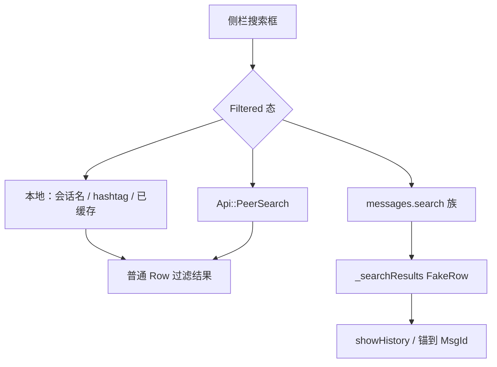

# 28 · 应用内搜索：全局、会话内、FakeRow、服务端 vs 本地

> 基于 `dev`：`dialogs/dialogs_widget.*` / `dialogs_inner_widget.*`、`dialogs/dialogs_row.h`（`FakeRow`）、`dialogs/ui/chat_search_*`、`api/api_peer_search.*`、`api/api_messages_search*`、`api/api_single_message_search.*`、`history/view/controls/history_view_compose_search.*`。列表层搜索入口已在 [04](04-dialogs-chat-list.md) 点到；本章补全 **会话内搜索** 与数据路径。推测处已标注。

搜索在 tdesktop 里至少三层：**侧栏全局/过滤**、**会话内 ComposeSearch**、以及 **Hashtag/Tags/Posts** 等旁路。命中「消息」时，侧栏不用普通 `Dialogs::Row`，而用 **`FakeRow`** 画成「伪会话行」。

## 1. 代码落点

| 路径 | 角色 |
|---|---|
| `dialogs/dialogs_widget.*` | 顶栏搜索框、`SearchProcessState`、调度 peer/messages/posts |
| `dialogs/dialogs_inner_widget.*` | `WidgetState::{Default, Filtered}`；`_searchResults`（`unique_ptr<FakeRow>`） |
| `dialogs/dialogs_row.h` | `Row` vs `FakeRow : BasicRow` |
| `dialogs/ui/chat_search_in.*` / `chat_search_empty.*` | 「在哪个聊天里搜」/ 空态 UI |
| `dialogs/dialogs_search_tags.*` / `dialogs_search_posts.*` | Tag / Public posts |
| `api/api_peer_search.*` | 全局找人/群（可含 sponsored） |
| `api/api_messages_search.*` | 单 `History` 上 `messages.search` 封装 |
| `api/api_messages_search_merged.*` | 主 History + migrated 合并 |
| `api/api_single_message_search.*` | 单条定位类搜索 |
| `history/view/controls/history_view_compose_search.*` | 会话中栏内搜索条 |

## 2. 全局 / 侧栏搜索（对接 04）

[04 §搜索入口](04-dialogs-chat-list.md) 已列：

| 能力 | 落点 |
|---|---|
| 顶栏输入 | `Dialogs::Widget` `_search` |
| 状态 | `InnerWidget`：`Default` ↔ `Filtered` |
| Peer 命中 | `Api::PeerSearch` → `PeerSearchResult{my, peers, sponsored}` |
| 消息命中行 | `vector`/`_searchResults` of **`FakeRow`** |
| Hashtag | `onHashtagFilterUpdate` + recent hashtags 本地读 |
| Tags | `SearchTags` / reaction tag |
| 打开「在此聊天中搜」 | `SessionController::searchInChat` |

`FakeRow`（`dialogs_row.h`）绑定：

- `Key searchInChat`（搜索上下文）
- `not_null<HistoryItem*> item`
- 可变绘制缓存：`Ui::MessageView _itemView`、`PeerBadge`、name、`DateTextCache`
- 可选 `ForumTopic* _topic`（`invalidateTopic`）

绘制仍走 `Ui::RowPainter` 好友路径，但语义是 **消息预览行**，点击应跳进对应 History 锚点（`InnerWidget` 里用 `item()->history()` + `fullId()`）。

## 3. 会话内搜索：`ComposeSearch`

`HistoryView::Controls::ComposeSearch`：挂在中栏（非侧栏），API 可见：

- `setQuery` / `setInnerFocus` / `hideAnimated`
- `setTopMsgId`、`setSearchFilter(Api::SearchFilter)`（`NoFilter` / `Pinned`）
- `setCalendarChat` + `setCalendarJumpHandler`（日历跳日期）
- `Activation` 结构 + 内部 `Inner` 类

数据侧通常接 `Api::MessagesSearch` 或 `MessagesSearchMerged`：

**`MessagesSearch`**

- `searchMessages(Request{query, from, tags, topMsgId, filter})`
- `searchMore`；结果 `rpl::producer<FoundMessages>`（`total`、`messages`、`nextToken`）
- 实现细节：`_cacheOfStartByToken`；`_searchInHistoryRequest` 注释写明 **不是真实 mtpRequestId**（与 History 预加载闸门同风格，见 07/08）

**`MessagesSearchMerged`**

- 同时搜当前 History 与 **migrated** 旧会话（群升级场景）；`disableMigrated()` 可关
- `newFounds` / `nextFounds` 事件；内部拼接 `_concatedFound`

**〔推测〕** ComposeSearch 的结果列表 UI 复用 chat_search 控件或自绘条，最终 `Activation` 驱动 `HistoryWidget`/`ListWidget` 滚到命中消息（与侧栏 FakeRow 点击殊途同归）。

## 4. 服务端 vs 本地

| 类型 | 本地优先 | 服务端 |
|---|---|---|
| 会话名 / 已加载 Dialogs 过滤 | `IndexedList` / Filtered 态字串匹配 | — |
| Recent hashtags / bots | `readRecentHashtagsAndBots` | — |
| Peer 搜索 | `PeerSearch::RequestType::CacheOnly` 可用缓存 | `contacts.search` 类 RPC（经 PeerSearch） |
| 聊天内全文 / 从某用户 / tags | 启动 token 缓存 `_cacheOfStartByToken` | `messages.search` / merged |
| Public posts | intro UI + 专用 API（`dialogs_search_posts`） | 是 |
| 单条 resolve | 视调用 | `SingleMessageSearch` |

经验规则：**列表过滤可以纯本地；内容搜索默认服务端，本地只做缓存与 migrated 拼接。**

## 5. 与 Dialogs 行模型的边界

| | 普通 `Row` | `FakeRow` |
|---|---|---|
| Key | 指向 `Entry`（History/Topic/…） | `searchInChat` 上下文 Key |
| 主实体 | Entry / Thread | `HistoryItem*` |
| 未读/置顶语义 | 完整 chatList | 不适用；展示消息预览 |
| 所在容器 | `_shownList` | `_searchResults` |

勿把 FakeRow 当成「临时 Dialogs::Entry」——它没有 Entry 生命周期，随搜索结果向量增删（topic 失效时 `invalidateTopic` / erase）。

## 6. 小结

- **侧栏**：Filtered 态 + PeerSearch + 消息命中 **FakeRow**（04 已列，本章钉结构）。
- **中栏**：`ComposeSearch` + `MessagesSearch(Merged)` + filter/日历。
- **本地**管名单与缓存；**服务端**管全文/跨设备内容；migrated 用 Merged 遮缝。

相关：[04](04-dialogs-chat-list.md)、[05](05-dialogs-impl-memory-perf.md)、[08](08-history-data-pagination.md)、[17](17-chat-folders-deep.md)、[25](25-history-dual-hosts.md)。
