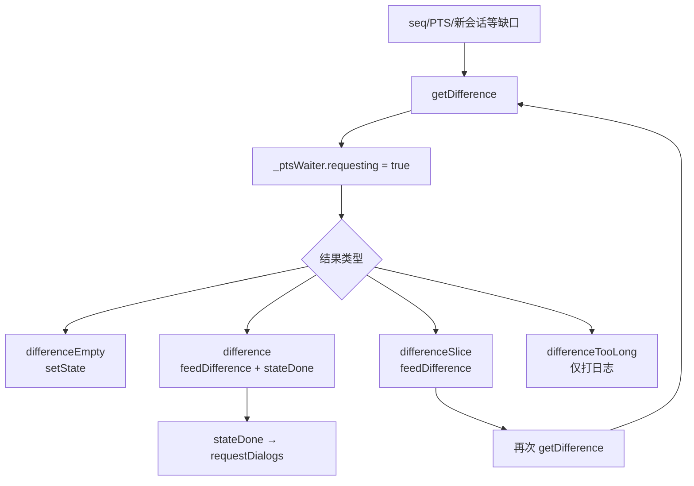
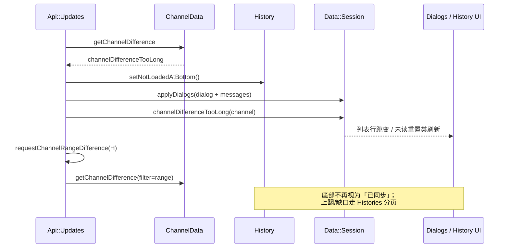

# 29 · Updates Difference 深潜：getDifference、频道差量、reorder 空洞

> 基于 `dev`：`api/api_updates.*`（含 `getDifference` / `getChannelDifference` / `requestChannelRangeDifference` 实现）、`data/data_pts_waiter.h`、以及 [14](14-api-updates.md) 已述入口。本章把 **差量补洞** 对 **Dialogs 跳变** 与 **History gap** 的影响写清；**未**穷尽 `feedUpdate` 每个 TL 分支。推测处已标注。

[14](14-api-updates.md) 给了 PTS/seq 与 `PtsWaiter` 总图。实时更新一旦出现缺口，客户端不是「丢事件」，而是停应用、拉 **difference**，再用返回的 users/chats/messages/other_updates 回填。频道另有独立 PTS 与 `getChannelDifference`；极端的 `channelDifferenceTooLong` 会迫使 **对话框重绑 + 历史底部失效 + range 差量校验**。

## 1. 何时进入差量

| 触发 | 行为（可核对） |
|---|---|
| `mtpNewSessionCreated` | 直接 `getDifference()` |
| seq 不连续 | `_bySeqUpdates` 缓存；`_bySeqTimer` 超时 → difference |
| PTS 缺口 | `PtsWaiter` skip 队列；超时/`updateAndApply` 失败路径 → difference |
| `requestingDifference()` 已真 | 新包多数推迟；群呼参与者等可旁路 |
| 频道 PTS 缺口 / short poll | `getChannelDifference(channel, PtsGapOrShortPoll\|…)` |
| `channelDifferenceTooLong` | `history->setNotLoadedAtBottom()` + `requestChannelRangeDifference` |
| difference RPC fail | `_failDifferenceTimeout` 指数退避；频道侧 `_channelFailDifferenceTimeout` |

`getDifference` 会清 `_bySeqUpdates`、取消 no-updates ping 定时器，并 `_ptsWaiter.setRequesting(true)`——此后 `requestingDifference()` 为真。

## 2. 全局 `updates.getDifference`

请求：`MTPupdates_GetDifference` 带当前 pts / date / qts（flags 与 limit 字段可空）。

`differenceDone` 分型：

| TL | 动作 |
|---|---|
| `updates.differenceEmpty` | 只 `setState`（date/seq）；结束 requesting |
| `updates.differenceSlice` | `feedDifference` → 写 intermediate state → **再** `getDifference()` |
| `updates.difference` | `feedDifference` → `stateDone`（完整 state + `requestDialogs` + `updateOnline`） |
| `updates.differenceTooLong` | 日志：**Telegram Desktop 不支持**（`API Error: … is not supported`） |

`feedDifference`：process users/chats → 处理 new messages → `feedUpdateVector`（other updates）。  
Slice 循环意味着大缺口会 **多轮** 差量；其间 UI 仍处「差量中」闸门。

## 3. 频道 `updates.getChannelDifference`

与全局 PTS **分离**：每频道自有 pts（`channel->pts*`）。

- 请求带 `channelMessagesFilterEmpty`、可选 `force` 旗（short poll 且非 waiting-for-skipped 时可去掉 force）。
- 上限 `kChannelGetDifferenceLimit`。
- `channelDifferenceDone`：
  - **Empty**：`ptsInit`
  - **TooLong**：process users/chats；若已有 History → `setNotLoadedAtBottom()` + `requestChannelRangeDifference`；`applyDialogs` 用返回的单个 dialog + messages；`channelDifferenceTooLong(channel)` 信号；Forum 则 `reloadTopics()`
  - **普通 Difference**：`feedChannelDifference`（`_handlingChannelDifference = true` 包裹）→ `ptsInit`
- `is_final` 为假 → 继续 `getChannelDifference`；为真且频道在 **active chats** → 按 timeout short-poll，否则 `ptsSetWaitingForShortPoll(-1)`。

`feedChannelDifference` 顺序：users/chats → convert scheduled → **先 `feedMessageIds`** → `processMessages(new, Unread)` → `feedUpdateVector(..., SkipMessageIds)`。  
先消化 message id 类更新、再插新消息，避免与 id 映射打架。

### Active chats 与 short poll

`addActiveChat(rpl::producer<PeerData*>)` 跟踪当前打开会话；进入频道会 `ptsSetWaitingForShortPoll(kWaitForChannelGetDifference)`，离开且不再 active 则关掉 short poll。  
→ **正在看的频道**更勤快补洞；后台频道靠全局更新 + 缺口触发。

## 4. Range difference：TooLong 后的「历史窗口校验」

`requestChannelRangeDifference(history)`：

1. 取消该频道上未完成的 range 请求。
2. `history->rangeForDifferenceRequest()` 得到 `MsgRange`；空或无 pts 则返回。
3. `channelRangeDifferenceSend`：用 **`channelMessagesFilter` + messageRange**（非 Empty filter）再打 `getChannelDifference`，limit = till−from。

语义：**TooLong 已用 dialog 快照重绑列表顶，但本地已加载的一段 history 可能与服务器不一致**——用 range filter 只校验/补这一窗。  
若 range 结果仍 TooLong，实现继续 match（同文件后续分支）；**〔推测〕** 最终仍可能留下 gap，交由用户上翻时的 GetHistory/空洞逻辑（[08](08-history-data-pagination.md)）再补。

## 5. 对 Dialogs「跳变」的影响

| 差量结果 | 列表侧可见效应 |
|---|---|
| `stateDone` 末尾 `requestDialogs` | 主列表可能整段重拉/对齐 pin 与顺序 |
| `applyDialogs`（TooLong 路径） | 单频道 dialog 快照替换：顶栏预览、未读、顺序键变化 → **行跳动** |
| `feedUpdateVector` 中的 reorder / pin / unread | 与日常 updates 相同，但在 requesting 闸门后批量到达，易一次跳多行 |
| Forum `reloadTopics` | 主题列表重建 |

[04](04-dialogs-chat-list.md)/[05](05-dialogs-impl-memory-perf.md) 的 `MainList` 排序对「批量 applyDialogs」敏感：差量不是逐条动画友好的路径，而是 **一致性优先**。

## 6. 对 History「空洞」的影响

| 机制 | History 后果 |
|---|---|
| `setNotLoadedAtBottom()` | 不再假设「最新页已齐」；底部加载闸门打开 |
| `processMessages(new, Unread)` | 插入差量带来的消息；与本地 blocks 之间可能出现 **id 间隙** |
| Range difference | 尝试填/验当前窗口；不保证整段历史连续 |
| 与 [08](08-history-data-pagination.md) Gap | 用户滚动触及空洞 → `MessagesList` gap / GetHistory 切片；与 PTS 差量是 **两层** 补洞 |
| `_handlingChannelDifference` | `feedUpdate` 内部分支看到该旗后改变行为（同文件多处 `if (channel && !_handlingChannelDifference)`）——差量喂入期间避免重入再拉差量或错误 short-circuit |

**〔推测〕** 全局 `differenceTooLong` 既然后端契约上「桌面不支持」，若服务器真返回，客户端只会打日志而 **不会** 走频道 TooLong 那套 dialog 重绑——实际依赖「不要让全局缺口大到 TooLong」（切片循环 + 及时 getDifference）。

## 7. 与 14 的分工

| [14](14-api-updates.md) | 本章 |
|---|---|
| ApiWrap vs Updates 所有权 | 差量 RPC 分型与循环 |
| PtsWaiter / seq 缓存总述 | TooLong、range filter、active short-poll |
| feedUpdate 点到为止 | 对 Dialogs 跳变 + History gap 的产品影响 |

## 8. 小结

- **全局差量**：Empty / Slice（循环）/ Full；Full 后 `requestDialogs`；TooLong 桌面直接报不支持。
- **频道差量**：独立 PTS；TooLong → 底部失效 + dialog 快照 + **range 差量**；active 频道 short-poll。
- **一致性优先于平滑**：批量 apply 会造成列表跳变与历史空洞，再由分页/gap 机构二次收敛。

相关：[14](14-api-updates.md)、[03](03-mtproto-networking.md)、[04](04-dialogs-chat-list.md)、[08](08-history-data-pagination.md)、[11](11-history-updates-jank.md)。
